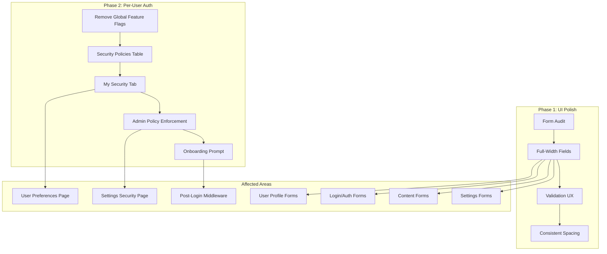
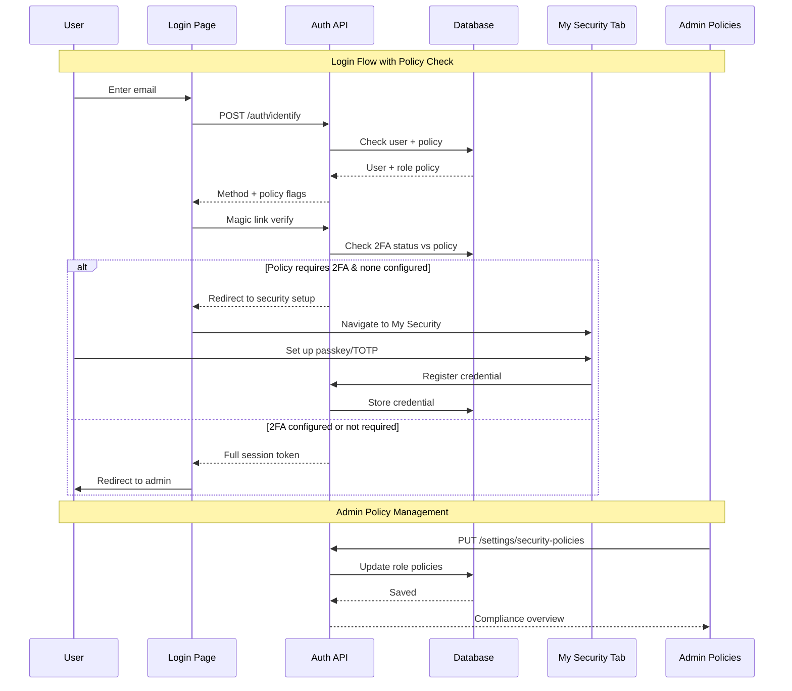

# Admin UI Polish & Per-User Auth Management

# Plan: Admin UI Polish & Per-User Auth Management

## Summary

Two-track improvement: (1) Make all admin forms full-width with better UX (validation, spacing, consistency) across all ~23 pages, and (2) restructure auth from global feature flags to per-user security management with admin policy enforcement and onboarding prompts.

## Architecture Diagram



## Tasks

### Phase 1: Full-Width Forms & UI Polish

- [ ] Task 1: Convert all settings form grids from `sm:grid-cols-2` to single-column full-width
  - AC: GeneralSettings, EmailSettings, StorageSettings, UserSettings all use full-width fields
  - AC: No field is constrained to half-width in any settings component
  - AC: Consistent `space-y-4` section spacing throughout

- [ ] Task 2: Polish content editing forms (FieldRenderer, FieldEditor, content type pages)
  - AC: FieldRenderer fields render full-width (already `w-full` but verify container constraints)
  - AC: FieldEditor modal uses full-width inputs
  - AC: Content type edit pages (`/admin/types/**`) have consistent full-width forms

- [ ] Task 3: Polish page builder and menu forms
  - AC: BlockSettings panel fields are full-width
  - AC: MenuItemForm fields are full-width
  - AC: Page metadata forms are full-width

- [ ] Task 4: Improve form validation UX across all forms
  - AC: Inline validation errors display below fields (not just toast)
  - AC: Required field indicators are consistent (asterisk or label)
  - AC: Save buttons disabled when form is invalid (not just when unchanged)
  - AC: Loading states on all async form submissions

- [ ] Task 5: Polish login and auth pages
  - AC: Login card uses consistent spacing with rest of admin
  - AC: 2FA page has clear visual hierarchy between passkey and TOTP options
  - AC: Error/success alerts use consistent patterns

### Phase 2: Per-User Auth Management

- [ ] Task 6: Remove global auth feature flags from config
  - AC: Remove `enableMagicLinks`, `enableWebAuthn`, `enableTOTP`, `requirePasswordless` from `publisher.config.ts`
  - AC: Remove corresponding env vars (`PUBLISHER_ENABLE_*`)
  - AC: All auth methods always available at the system level
  - AC: Remove feature flag checks from all API routes and UI components
  - AC: Keep WebAuthn RP config (rpName, rpID, origin) — those are infrastructure, not feature flags

- [ ] Task 7: Create security policies database table and API
  - AC: New `publisher_security_policies` table with columns: `id`, `role` (unique), `require2FA` (boolean), `allowedMethods` (JSON array), `createdAt`, `updatedAt`
  - AC: Default policy: all methods allowed, 2FA not required
  - AC: API endpoints: `GET/PUT /api/publisher/settings/security-policies` (admin-only)
  - AC: Policy checked during login flow — if user's role requires 2FA and they have none, redirect to setup

- [ ] Task 8: Build "My Security" tab in user preferences
  - AC: New tab in settings page: "My Security" (between "My Preferences" and "Email")
  - AC: Shows current auth methods status (magic link always on, passkey count, TOTP status)
  - AC: Passkey management: list, add, rename, delete passkeys
  - AC: TOTP management: setup with QR code, verify, disable, backup codes
  - AC: Trusted devices list with revoke option
  - AC: Recent auth activity (audit log excerpt)
  - AC: Reuses existing composables (`useWebAuthn`, `useTOTP`, `usePublisherAuth`)

- [ ] Task 9: Refactor `/admin/settings/security` to admin policy management
  - AC: Page becomes "Security Policies" — admin-only
  - AC: Per-role policy configuration (require 2FA toggle, allowed methods checkboxes)
  - AC: Shows compliance overview: which users meet policy, which don't
  - AC: Remove personal auth method management (moved to "My Security" tab)

- [ ] Task 10: Security onboarding prompt after first login
  - AC: New middleware checks if user has no 2FA methods configured and role policy requires it
  - AC: Shows a dismissible prompt/banner: "Secure your account — set up a passkey or authenticator app"
  - AC: If role policy *requires* 2FA, redirect to My Security tab (not dismissible)
  - AC: If role policy *recommends* 2FA, show banner that can be dismissed (stores dismissal in user preferences)
  - AC: Prompt shown after magic link verification, before entering admin

## Technical Approach

### Phase 1: Full-Width Fields

**Key files to modify:**
- `lib/publisher-admin/components/publisher/settings/GeneralSettings.vue` — Remove `sm:grid-cols-2` grids
- `lib/publisher-admin/components/publisher/settings/EmailSettings.vue` — Same
- `lib/publisher-admin/components/publisher/settings/StorageSettings.vue` — Same
- `lib/publisher-admin/components/publisher/settings/UserSettings.vue` — Same, make all fields `sm:col-span-2` equivalent
- `lib/publisher-admin/components/publisher/FieldEditor.vue` — Verify full-width
- `lib/publisher-admin/pages/admin/content/[type]/[id].vue` — Content edit page
- `lib/publisher-admin/pages/admin/content/[type]/new.vue` — Content create page
- All pages under `lib/publisher-admin/pages/admin/types/` — Type management

**Pattern:** Replace `grid gap-4 sm:grid-cols-2` with `space-y-4` (stacked full-width). Use `max-w-2xl` container on form sections to prevent stretching on wide screens.

### Phase 2: Auth Restructuring

**Database changes:**
```sql
CREATE TABLE publisher_security_policies (
  id INTEGER PRIMARY KEY,
  role TEXT UNIQUE NOT NULL,
  require_2fa BOOLEAN DEFAULT false,
  allowed_methods TEXT DEFAULT '["magic-link","passkey","totp"]',
  created_at TEXT DEFAULT (datetime('now')),
  updated_at TEXT DEFAULT (datetime('now'))
);
```

**Config changes in `publisher.config.ts`:**
- Remove `features.enableMagicLinks`, `enableWebAuthn`, `enableTOTP`, `requirePasswordless`
- Keep `features.allowMultipleAuthMethods`
- Keep all WebAuthn RP, TOTP issuer, and device tracking config

**New "My Security" component:**
- Extracts passkey, TOTP, device, and audit sections from current `security.vue` page
- Becomes a new tab component: `MySecuritySettings.vue`
- Reuses existing composables — no new API endpoints needed for personal management

**Security policies API:**
- New `server/api/publisher/settings/security-policies.get.ts`
- New `server/api/publisher/settings/security-policies.put.ts`
- Policy enforcement in `server/api/publisher/auth/magic-link/verify.ts` and `server/api/publisher/auth/verify-second-factor.ts`

**Onboarding middleware:**
- New middleware `lib/publisher-admin/middleware/security-onboarding.ts`
- Checks user's 2FA status against role policy after login
- Sets a `security-setup-required` flag in the auth response

## Data Flow



## Risks & Mitigations

| Risk | Impact | Likelihood | Mitigation |
|------|--------|------------|------------|
| Removing feature flags breaks existing deployments | High | Medium | Keep env vars temporarily as no-ops with deprecation warning in logs for 1 release |
| Users locked out if policy requires 2FA mid-session | Medium | Low | Only enforce on next login, not active sessions |
| Full-width forms look stretched on wide screens | Low | Medium | Use `max-w-2xl` container on form sections |
| Security page refactor loses existing functionality | High | Low | Extract to new component first, then restructure — no deletion until new UI works |

## Estimated Effort

- **Complexity**: Medium-High
- **Phase 1 (UI)**: ~4-6 hours
- **Phase 2 (Auth)**: ~8-12 hours
- **Dependencies**: Phase 2 Task 8 depends on Task 6 (flag removal); Task 10 depends on Task 7 (policies table)

## Key Decisions

1. **Decision**: Remove global feature flags entirely rather than making them per-user overrides
   **Rationale**: Simpler model — all methods always available, policies control requirements not availability. No "disabled passkeys for everyone" scenario.

2. **Decision**: Per-role policies (not per-user)
   **Rationale**: Simpler admin UX. Roles already map to trust levels (super-admin > admin > editor > viewer). Per-user overrides would add complexity with little benefit.

3. **Decision**: "My Security" as a tab in settings, not a separate page
   **Rationale**: Keeps all user-facing settings in one place. The existing `/admin/settings/security` page becomes the admin-only policy page.

4. **Decision**: `max-w-2xl` container for full-width forms
   **Rationale**: Full-width on ultrawide monitors looks bad. Capping at ~672px keeps forms readable while feeling spacious.

## Suggested Branch Name
`feature/admin-ui-polish-per-user-auth`
