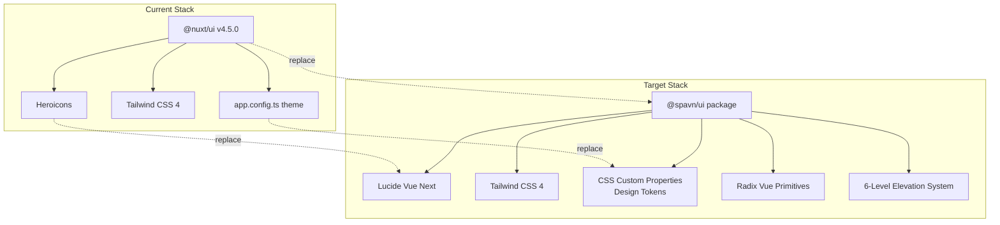
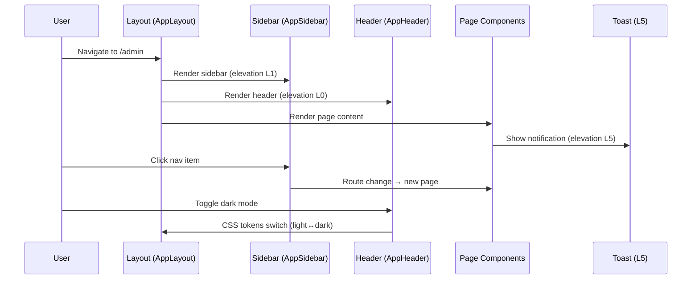
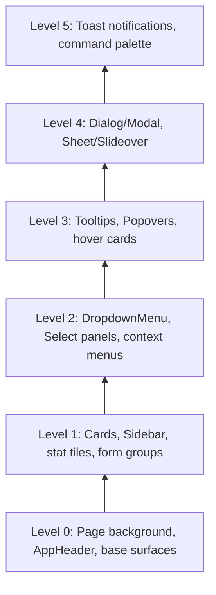

# Spavn UI Migration — Complete @nuxt/ui Replacement

# Plan: Spavn UI Migration — Complete @nuxt/ui Replacement

## Summary
Replace the entire @nuxt/ui component library in the Publisher admin with @spavn/ui (package import method). This covers all 22 unique @nuxt/ui components across ~50 files, 71 Heroicon → Lucide icon migrations, the `useToast` composable (23 files), and a UX rethink of the admin shell using spavn-ui's AppLayout, elevation system, and design token architecture. The default gray color scheme with light/dark mode replaces the current amber/stone theme.

## Architecture Diagram


## Component Migration Map

```mermaid
graph LR
    subgraph "@nuxt/ui → @spavn/ui"
        UButton["UButton (47 files)"] --> Button
        UIcon["UIcon (49 files)"] --> Icon["Icon + Lucide"]
        UFormField["UFormField (24 files)"] --> FormItem["FormItem/FormLabel"]
        UInput["UInput (31 files)"] --> Input
        UModal["UModal (20 files)"] --> Dialog
        USelect["USelect (13 files)"] --> Select
        USwitch["USwitch (13 files)"] --> Switch
        UBadge["UBadge (11 files)"] --> Badge
        UAlert["UAlert (10 files)"] --> Alert
        UTextarea["UTextarea (8 files)"] --> Textarea
        UTable["UTable (9 files)"] --> DataTable["Table/DataTable"]
        USelectMenu["USelectMenu (6 files)"] --> Select2["Select/MultiSelect"]
        UPagination["UPagination (6 files)"] --> Pagination
        UTooltip["UTooltip (3 files)"] --> Tooltip
        UCard["UCard (4 files)"] --> Card
        USlideover["USlideover (3 files)"] --> Sheet
        USeparator["USeparator (1 file)"] --> Separator
        URadio["URadio (1 file)"] --> Radio["Radio/RadioGroup"]
        UCheckbox["UCheckbox (1 file)"] --> Checkbox
        UTabs["UTabs (1 file)"] --> Tabs
        UDropdownMenu["UDropdownMenu (1 file)"] --> DropdownMenu
        UApp["UApp (1 file)"] --> Removed["Removed (no wrapper needed)"]
    end
```


## Tasks

- [ ] Task 1: Foundation — Initialize spavn-ui & remove @nuxt/ui
  - AC: `npx spavn-ui init` run successfully in the project
  - AC: `@spavn/ui` and `lucide-vue-next` installed as dependencies
  - AC: `@nuxt/ui` module removed from nuxt.config.ts and package.json
  - AC: `app.config.ts` ui config removed (no longer needed)
  - AC: Design tokens configured in main.css with default gray scheme (light + dark)
  - AC: Tailwind CSS 4 config updated for spavn-ui compatibility
  - AC: Project compiles without errors (pages will be broken — expected)

- [ ] Task 2: App Shell — Replace admin layout with spavn-ui AppLayout
  - AC: `app.vue` updated — remove UApp wrapper
  - AC: Admin layout rebuilt using `AppLayout`, `AppSidebar`, `AppHeader`, `AppMain`
  - AC: Sidebar uses spavn-ui elevation level 1 with proper z-indexing
  - AC: Topbar rebuilt with `AppHeader` component
  - AC: Sidebar IA improved: API Tokens moved to System section
  - AC: Collapsible sections use spavn-ui `Collapsible` component
  - AC: Dark mode toggle works with spavn-ui token system
  - AC: Navigation items styled with active/hover/disabled states
  - AC: Sidebar footer shows version info
  - AC: Layout is responsive and matches elevation system guidelines

- [ ] Task 3: Icon Migration — Heroicons → Lucide
  - AC: All 71 unique Heroicons mapped to Lucide equivalents
  - AC: Create a shared icon mapping utility or constants file
  - AC: Replace all `<UIcon name="i-heroicons-*">` with `<Icon :icon="LucideIcon" />` pattern
  - AC: No Heroicon references remain in the codebase
  - AC: Icon sizing consistent with spavn-ui conventions

- [ ] Task 4: Core Component Migration — Button, Input, FormField
  - AC: All 47 files using UButton migrated to spavn-ui `Button` with correct variant/size mapping
  - AC: Button variant mapping: solid→default, ghost→ghost, outline→outline, link→link, soft→outline
  - AC: Button color mapping: primary→default, error/destructive→destructive, neutral→outline
  - AC: All 31 files using UInput migrated to spavn-ui `Input`/`InputGroup`
  - AC: All 24 files using UFormField migrated to `FormItem`/`FormLabel`/`FormMessage`
  - AC: Loading states on buttons preserved
  - AC: All click handlers and v-model bindings work correctly

- [ ] Task 5: Form Component Migration — Select, Switch, Textarea, Radio, Checkbox
  - AC: All 13 files using USelect migrated to spavn-ui `Select`
  - AC: All 6 files using USelectMenu migrated to spavn-ui `Select` or `MultiSelect`
  - AC: All 13 files using USwitch migrated to spavn-ui `Switch`
  - AC: All 8 files using UTextarea migrated to spavn-ui `Textarea`
  - AC: URadio (1 file) migrated to `Radio`/`RadioGroup`
  - AC: UCheckbox (1 file) migrated to `Checkbox`
  - AC: All v-model bindings and validation patterns preserved

- [ ] Task 6: Overlay Component Migration — Modal, Slideover, DropdownMenu, Tooltip
  - AC: All 20 files using UModal migrated to spavn-ui `Dialog` (elevation level 4)
  - AC: All 3 files using USlideover migrated to spavn-ui `Sheet` (elevation level 4)
  - AC: UDropdownMenu (1 file) migrated to spavn-ui `DropdownMenu` (elevation level 2)
  - AC: UTooltip (3 files) migrated to spavn-ui `Tooltip` (elevation level 3)
  - AC: v-model:open and @close patterns preserved
  - AC: Modal max-width behavior preserved (40rem cap)

- [ ] Task 7: Data & Feedback Component Migration — Table, Badge, Alert, Pagination, Tabs, Card, Separator
  - AC: All 9 files using UTable migrated to spavn-ui `Table` or `DataTable`
  - AC: All 11 files using UBadge migrated to spavn-ui `Badge`
  - AC: All 10 files using UAlert migrated to spavn-ui `Alert`
  - AC: All 6 files using UPagination migrated to spavn-ui `Pagination`
  - AC: UTabs (1 file) migrated to spavn-ui `Tabs`
  - AC: UCard (4 files) migrated to spavn-ui `Card` with elevation level 1
  - AC: USeparator (2 uses) migrated to spavn-ui `Separator`

- [ ] Task 8: Toast Composable Migration
  - AC: Create a `useAppToast` composable wrapping spavn-ui's Toast system
  - AC: All 23 files using `useToast().add()` migrated to new composable
  - AC: Toast notifications appear at elevation level 5
  - AC: Toast color mapping: error→destructive, success→default, warning→warning
  - AC: Toast behavior (auto-dismiss, positioning) matches or improves current UX

- [ ] Task 9: Dashboard & Page UX Rethink
  - AC: Dashboard stat cards rebuilt with spavn-ui `Card` + elevation system
  - AC: Dashboard uses consistent gray color scheme (no amber/emerald/violet accent cards)
  - AC: Admin pages use consistent spacing and typography from design tokens
  - AC: Empty states use spavn-ui `Empty` component
  - AC: Loading states use spavn-ui `Skeleton` component where appropriate
  - AC: All pages render correctly in both light and dark mode

- [ ] Task 10: Cleanup & Verification
  - AC: No @nuxt/ui imports remain anywhere in the codebase
  - AC: No Heroicon references remain
  - AC: No `i-heroicons-*` class references remain
  - AC: No `UApp`, `UButton`, `UIcon`, or any U-prefixed component references remain
  - AC: `@nuxt/ui` removed from package.json dependencies
  - AC: Dark mode works end-to-end (system preference + manual toggle)
  - AC: All admin pages load without console errors
  - AC: Elevation system applied consistently (L0 base, L1 cards, L2 dropdowns, L3 tooltips, L4 modals, L5 toasts)

## Technical Approach

### Phase 1: Foundation (Tasks 1-2)
Set up spavn-ui infrastructure and rebuild the app shell. This is the most architectural phase — getting the layout, tokens, and elevation system right sets the tone for everything else.

**Key decisions:**
- Remove `@nuxt/ui` Nuxt module entirely — spavn-ui components are imported directly per-file
- Design tokens go in `main.css` using CSS custom properties (replacing app.config.ts theme)
- Auto-imports configured in nuxt.config.ts for spavn-ui components (optional — explicit imports are also fine with package method)
- AppLayout replaces the manual sidebar+topbar layout with proper elevation stacking

### Phase 2: Systematic Component Swap (Tasks 3-7)
Work through components by category, highest-usage first. Each task is independently completable and testable.

**Icon strategy:** Create an `iconMap.ts` that maps old Heroicon names to Lucide component imports. This centralizes the mapping and makes it easy to verify completeness.

**Prop mapping patterns:**
```
UButton color="primary" variant="solid"  →  Button variant="default"
UButton color="error"                    →  Button variant="destructive"
UButton variant="ghost"                  →  Button variant="ghost"
UButton variant="outline"               →  Button variant="outline"
UButton icon="i-heroicons-plus"          →  Button with <Plus /> icon in slot
UInput v-model="x" placeholder="y"       →  Input v-model="x" placeholder="y" (nearly 1:1)
UModal v-model:open="x"                  →  Dialog v-model:open="x"
```

### Phase 3: Composable & UX Polish (Tasks 8-9)
Replace the toast system and rethink page-level UX. Dashboard gets rebuilt with the new design language.

### Phase 4: Cleanup (Task 10)
Final sweep to ensure no remnants of @nuxt/ui remain. Verify every page, every mode, every elevation level.

## Data Flow


## Elevation System Application


## Risks & Mitigations
| Risk | Impact | Likelihood | Mitigation |
|------|--------|------------|------------|
| Nuxt module removal breaks SSR | High | Medium | Test SSR rendering after foundation phase; spavn-ui is client-compatible Vue 3 |
| Icon mapping gaps (no Lucide equivalent) | Low | Low | Lucide has 1500+ icons; fallback to closest match or custom SVG |
| Form validation breaks during migration | High | Medium | Preserve vee-validate/zod patterns; test each form after migration |
| Auto-import conflicts without @nuxt/ui module | Medium | Medium | Configure explicit imports in nuxt.config.ts or use manual imports |
| Dark mode token mismatch | Medium | Low | Use spavn-ui's default gray tokens which have built-in dark mode support |
| UTable → DataTable API differences | Medium | Medium | Map column definitions carefully; test sorting/pagination |

## Estimated Effort
- **Complexity**: High
- **Tasks**: 10 discrete tasks
- **Dependencies**: Tasks 1-2 must complete before 3-10; Tasks 3-9 can be parallelized

## Key Decisions
1. **Package import over CLI copy** — Components imported from `@spavn/ui` directly. Simpler dependency management, automatic updates, no local component files to maintain.
   **Rationale**: User preference for clean dependency management.

2. **Default gray color scheme** — Replacing amber/stone with spavn-ui's default gray tokens.
   **Rationale**: User wants a neutral, professional look. Gray scheme provides excellent light/dark mode contrast out of the box.

3. **Big-bang migration** — All components swapped in one effort rather than gradual coexistence.
   **Rationale**: Avoids mixing two component libraries (anti-pattern per spavn-ui guidelines). Cleaner codebase, single PR.

4. **Sidebar IA fix** — Move API Tokens from Types → System section during the rebuild.
   **Rationale**: API Tokens are a system/settings concern, not a content type concern.

5. **Explicit Lucide imports** — Each component imports only the icons it needs from `lucide-vue-next`.
   **Rationale**: Tree-shaking friendly, no icon font overhead.

## Suggested Branch Name
`refactor/spavn-ui-migration`