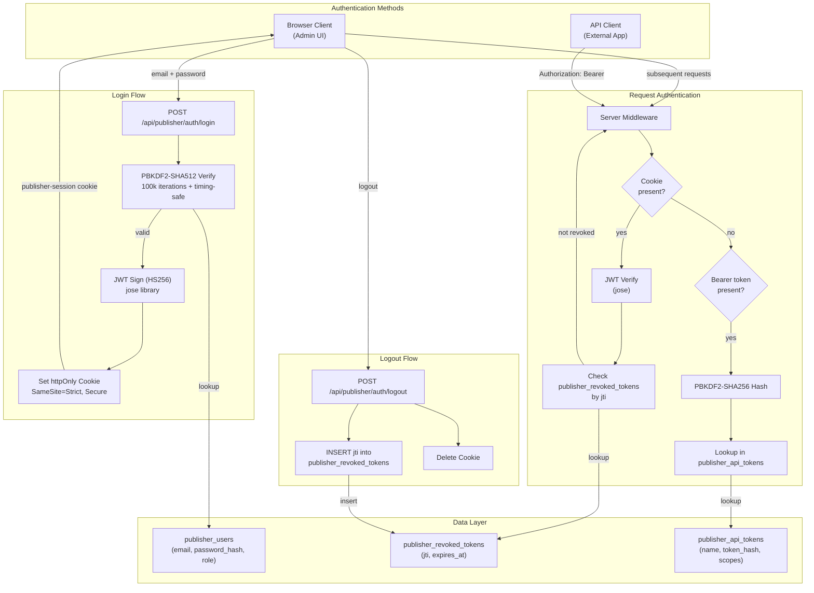

# Decision: Authentication Architecture

## Context

Publisher CMS needs two distinct authentication mechanisms:

1. **Admin UI sessions** — Browser-based users managing content through the `/admin` interface need secure, persistent sessions with logout capability.
2. **Programmatic API access** — External applications, CI/CD pipelines, and frontend apps need stateless, scoped tokens for content API operations.

The system must support role-based access control (super-admin, admin, editor, viewer), server-side session revocation (logout), and resistance to common web attacks (XSS, CSRF, timing attacks).

## Decision

Publisher uses a **dual authentication strategy**:

- **Admin sessions:** JWT tokens (HS256 via `jose`) stored in httpOnly cookies, with server-side revocation via a `publisher_revoked_tokens` blocklist table.
- **API tokens:** PBKDF2-SHA256 hashed bearer tokens stored in `publisher_api_tokens`, with scopes and optional expiry.
- **Password hashing:** PBKDF2-SHA512 with 100,000 iterations, 32-byte random salt, and timing-safe comparison.

## Architecture

## Rationale

### Why JWT + Cookie (not opaque session tokens)?

- **Stateless verification** — JWTs can be verified without a database lookup on every request (only revocation checks hit the DB). This keeps the common path fast.
- **Embedded claims** — The `userId` and `role` are encoded in the token, eliminating a user lookup on every authenticated request.
- **httpOnly + SameSite=Strict cookies** — Prevents XSS-based token theft (JavaScript cannot read the cookie) and CSRF attacks (browser won't send the cookie cross-origin).

### Why PBKDF2-SHA512 (not bcrypt/argon2)?

- **Zero native dependencies** — PBKDF2 is built into Node.js `crypto`. No need for `bcrypt` (which requires native compilation) or `argon2` (which requires a Rust/C toolchain). This simplifies deployment and CI.
- **100,000 iterations** — OWASP-recommended minimum for PBKDF2-SHA512, providing strong brute-force resistance.
- **Timing-safe comparison** — Uses `crypto.timingSafeEqual()` to prevent timing side-channel attacks on password verification.

### Why server-side JWT revocation?

- Pure JWTs cannot be invalidated before expiry. The `publisher_revoked_tokens` table stores the `jti` (JWT ID) of revoked tokens, checked on each authenticated request.
- Revoked entries include `expires_at` so they can be periodically cleaned up (no unbounded table growth).

### Why separate API tokens?

- API tokens are designed for machine-to-machine access where cookies don't apply.
- Tokens are hashed with PBKDF2-SHA256 before storage — the plaintext is shown once at creation and never stored.
- Each token has a visible `prefix` (first 8 chars) for identification without exposing the full token.
- Tokens support `scopes` (JSON array) and optional `expires_at` for fine-grained access control.

## Consequences

### Positive

- **No external auth service** — Everything runs within the Nuxt/Nitro process with zero dependencies on Redis, Auth0, or similar services.
- **Strong defaults** — httpOnly cookies, SameSite=Strict, Secure flag in production, PBKDF2 with high iteration count, timing-safe comparisons.
- **Clean separation** — Admin sessions (cookie-based) and API tokens (bearer-based) serve different use cases without conflicting.
- **Revocation support** — Unlike pure JWT systems, Publisher can immediately invalidate sessions on logout or user deactivation.

### Negative

- **Revocation table growth** — Every logout adds a row to `publisher_revoked_tokens`. Requires periodic cleanup of expired entries (tokens past their `expires_at`).
- **PBKDF2 is CPU-bound** — 100,000 iterations of PBKDF2-SHA512 blocks the event loop for ~50-100ms per password verification. This is acceptable for admin login (infrequent) but would not scale for high-throughput auth. The synchronous `pbkdf2Sync` call is used for simplicity.
- **Single signing secret** — All JWTs share one `PUBLISHER_SECRET`. Key rotation requires invalidating all existing sessions.

### Neutral

- **7-day token expiry** — Balances convenience (users don't re-login daily) with security (limits exposure window). Configurable via `publisher.config.ts`.
- **Role stored in JWT** — Role changes don't take effect until the user's current token expires or they re-login. This is a standard JWT trade-off.

## Alternatives Considered

1. **Opaque session tokens + Redis** — Rejected because it introduces an external dependency (Redis) for a system designed to be zero-dependency and SQLite-only. The JWT + revocation table approach achieves the same result with the existing database.

2. **bcrypt for password hashing** — Rejected because `bcrypt` requires native compilation (`node-gyp`), which complicates Docker builds and CI pipelines. PBKDF2-SHA512 with 100k iterations provides equivalent security using Node.js built-ins.

3. **Argon2 for password hashing** — Rejected for the same native dependency reason as bcrypt. Argon2 is technically superior (memory-hard) but the deployment complexity is not justified for a CMS admin panel with a small user base.

4. **OAuth2 / OpenID Connect** — Rejected as overkill for a self-hosted CMS. Publisher targets developer teams who want a simple, self-contained system. OAuth2 could be added as an optional module in the future.

5. **Passport.js** — Rejected because Publisher uses Nitro (not Express), and Passport's middleware model doesn't align with H3's event handler pattern. The auth logic is simple enough to implement directly.

## Related Files

- `server/utils/publisher/auth.ts`
- `server/utils/publisher/db.ts`
- `server/api/publisher/auth/login.post.ts`
- `server/api/publisher/auth/logout.post.ts`
- `server/api/publisher/auth/me.get.ts`
- `publisher.config.ts`
