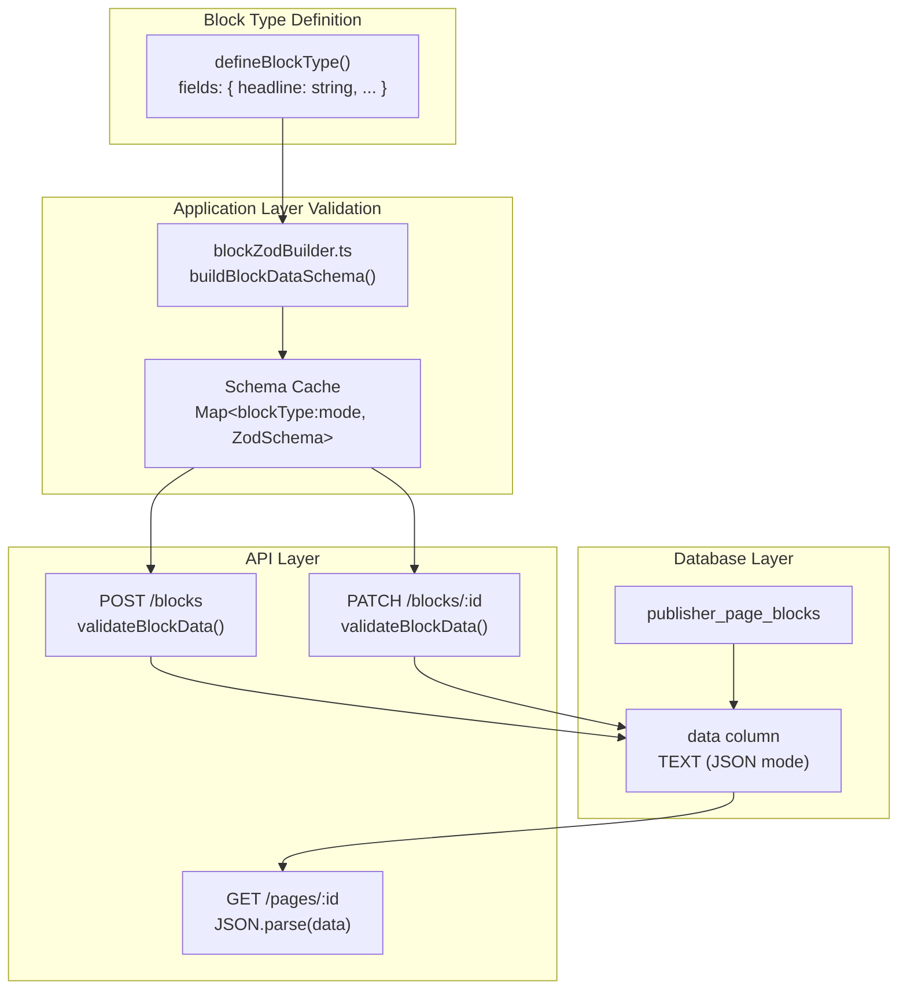

# Decision: JSON Block Data Storage

## Context

The Page Builder system needs to persist block content data for 18+ block types, each with a different set of fields (e.g., a Hero block has `headline`, `subtitle`, `backgroundImage`, `ctaText`, `ctaUrl`, `ctaVariant`, `alignment`, `overlay`; a Rich Text block has only `content`). New block types can be added by developers at any time by dropping a file into `block-types/`.

The core question: **How should we store the per-block field data in the database?**

## Decision

Store all block content data as a **single JSON column** (`data TEXT` with `mode: 'json'`) in the `publisher_page_blocks` table. Each row stores one block instance with its type, position, and a JSON blob of field values:

```sql
CREATE TABLE publisher_page_blocks (
  id          INTEGER PRIMARY KEY AUTOINCREMENT,
  page_id     INTEGER NOT NULL REFERENCES publisher_pages(id) ON DELETE CASCADE,
  area_name   TEXT    NOT NULL,
  block_type  TEXT    NOT NULL,
  sort_order  INTEGER NOT NULL DEFAULT 0,
  data        TEXT    NOT NULL DEFAULT '{}',   -- JSON blob
  created_at  TEXT    NOT NULL,
  updated_at  TEXT    NOT NULL
);
```

Validation is handled at the **application layer** using Zod schemas that are dynamically generated from each block type's field definitions and cached per block type.

## Architecture



## Rationale

- **Schema-free extensibility** — Adding a new block type requires zero database migrations. A developer drops a file in `block-types/`, the server registers it, and the JSON column stores whatever fields are defined. This is critical for a plugin-like block system where the set of block types is open-ended.

- **Heterogeneous data in one table** — 18 block types have wildly different field shapes. Normalizing each into its own table would require 18+ tables (growing with every new block type), complex JOIN queries to load a page, and a migration for every new block type. A single table with a JSON column keeps the schema simple and queries fast.

- **Read-path simplicity** — Loading a page with all its blocks is a single query: `SELECT * FROM publisher_page_blocks WHERE page_id = ? ORDER BY area_name, sort_order`. No JOINs, no UNION ALLs across block-specific tables. The JSON is parsed in application code and returned directly in the API response.

- **SQLite JSON support** — SQLite has built-in JSON functions (`json_extract`, `json_each`, etc.) available if we ever need to query into block data. Drizzle's `{ mode: 'json' }` handles serialization/deserialization transparently.

- **Application-layer validation is sufficient** — Block data is always written through the API, which validates against Zod schemas derived from the block type's field definitions. The schemas are cached after first build, so validation overhead is negligible. This gives us the same safety as database constraints but with richer error messages and no migration burden.

## Consequences

### Positive
- **Zero-migration extensibility** — New block types work immediately without any database changes
- **Simple queries** — One table, one query to load all blocks for a page
- **Fast reads** — No JOINs; block data is returned as-is from the JSON column
- **Flexible schema** — Block fields can be any supported type (string, number, boolean, enum, media reference, relation, JSON, etc.) without database schema changes
- **Cached validation** — Zod schemas are built once per block type and reused

### Negative
- **No database-level constraints on block data** — Field-level uniqueness, foreign key references within block data, and NOT NULL constraints are enforced only at the application layer. A direct SQL INSERT could bypass validation.
- **No indexed queries on block content** — You cannot efficiently query "find all blocks where headline contains X" without full-table scans or SQLite JSON functions (which are not indexed by default). This is acceptable because block data is always accessed by page_id, never searched across pages.
- **Larger row size** — Each block row contains the full JSON payload. For blocks with large rich-text content or many fields, rows can be several KB. This is mitigated by SQLite's efficient handling of TEXT columns and the fact that pages typically have 5–20 blocks.

### Neutral
- **Drizzle `mode: 'json'`** handles `JSON.stringify` on write and `JSON.parse` on read automatically, so application code works with plain objects
- **Block data is opaque to the database** — Reporting or analytics on block content requires application-level processing, not SQL queries

## Alternatives Considered

1. **Normalized tables per block type** (e.g., `block_hero`, `block_rich_text`, `block_cta`) — Rejected because it requires a new migration and table for every block type added, makes page loading require N JOINs or UNION ALLs, and fundamentally conflicts with the goal of drop-in extensibility. This approach is appropriate for a fixed set of content types (which Publisher already uses for `content-types/`) but not for an open-ended block system.

2. **Entity-Attribute-Value (EAV) pattern** (a `block_fields` table with `block_id`, `field_name`, `field_value`) — Rejected because EAV queries are notoriously slow and complex, require multiple rows per block (one per field), make it difficult to enforce types (everything is a string), and add significant complexity for no real benefit over JSON in this use case.

3. **Separate JSON document store** (e.g., a dedicated JSON file per page, or a document database) — Rejected because it would add operational complexity (another storage system to manage), break transactional consistency with the pages table, and SQLite's JSON support is more than sufficient for this workload.


## Related Files

- `server/utils/publisher/db.ts`
- `server/utils/publisher/blockZodBuilder.ts`
- `server/api/v1/pages/[id]/blocks/index.post.ts`
- `server/api/v1/pages/[id]/blocks/[blockId].patch.ts`
- `lib/publisher/types.ts`
