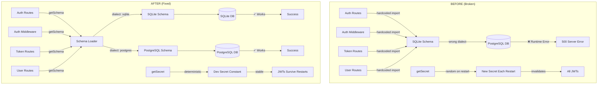

# Decision: Fix Authentication — Hardcoded SQLite Schema + Dev Secret Instability

## Context

Two critical authentication bugs were discovered that caused runtime failures and poor developer experience:

1. **Hardcoded SQLite Schema**: All 11 auth-related server files (middleware, routes for login/logout/me, token CRUD, user CRUD) were importing schema tables directly from `schema/sqlite.ts`. When running against PostgreSQL, this caused runtime errors because the SQLite schema definitions were incompatible with the PostgreSQL database driver.

2. **Dev Secret Instability**: The `getSecret()` function in `auth.ts` generated a new random secret on every server restart when `PUBLISHER_SECRET` was not set. This invalidated all existing JWTs, forcing developers to re-login after every code change or server restart.

3. **Config Inconsistency**: `publisher.config.ts` documented bcrypt as the password hashing algorithm, but the actual implementation uses PBKDF2-SHA512.

## Architecture



## Decision

### 1. Schema Resolution via `getSchema()`

Added a new `getSchema()` function to `server/utils/publisher/database/index.ts` that:
- Uses the singleton provider to determine the active dialect
- Calls `loadSchema(dialect)` to dynamically import the correct schema
- Caches the result in a singleton (`_schema`) for performance

All 11 auth-related files were updated to use `getSchema()` instead of direct imports:

```typescript
// Before (broken on PostgreSQL)
import { publisherUsers } from '../../../utils/publisher/database/schema/sqlite'

// After (works on both SQLite and PostgreSQL)
const schema = await getSchema()
db.select().from(schema.publisherUsers)
```

### 2. Deterministic Dev Secret

Changed `getSecret()` in `auth.ts` to use a deterministic development secret instead of generating a random one:

```typescript
// Before (random on every restart)
const devSecret = randomBytes(32).toString('hex')

// After (stable across restarts)
const devSecret = 'publisher-dev-secret-do-not-use-in-production'
```

### 3. Config Documentation Fix

Updated `publisher.config.ts` to correctly document PBKDF2-SHA512 as the password hashing algorithm instead of bcrypt.

## Rationale

### Why `getSchema()` over alternatives

1. **Consistency**: Matches the existing pattern of `getProvider()` and `getDb()` singletons
2. **Type Safety**: Returns `SchemaMap` with consistent property names across dialects
3. **Performance**: Schema is loaded once and cached
4. **Minimal Change**: Auth routes already use `getDb()`, adding `getSchema()` is a natural extension

### Why deterministic dev secret

1. **Developer Experience**: Developers can restart the server without losing their session
2. **Explicit Warning**: Console warning makes it clear this is development-only
3. **Production Safety**: Still throws a hard error if `PUBLISHER_SECRET` is missing in production
4. **Security**: The dev secret is obviously not for production use

## Consequences

### Positive

- **PostgreSQL Support**: Auth system now works correctly on both SQLite and PostgreSQL
- **Developer Experience**: Sessions survive server restarts in development
- **Accurate Documentation**: Config file now matches actual implementation
- **No Breaking Changes**: API surface remains identical for consumers

### Negative

- **Async Requirement**: All auth routes now need to `await getSchema()` before querying
- **Dev Secret in Code**: Deterministic dev secret is embedded in source (acceptable for dev-only)

### Neutral

- **Caching Behavior**: Schema is cached for the lifetime of the server process; schema migrations during runtime would require server restart

## Files Changed

| File | Change |
|------|--------|
| `server/utils/publisher/database/index.ts` | Added `getSchema()` function |
| `server/middleware/publisher-auth.ts` | Use `getSchema()` |
| `server/api/publisher/auth/login.post.ts` | Use `getSchema()` |
| `server/api/publisher/auth/me.get.ts` | Use `getSchema()` |
| `server/api/publisher/auth/logout.post.ts` | Use `getSchema()` |
| `server/api/publisher/tokens/index.ts` | Use `getSchema()` |
| `server/api/publisher/tokens/[id].delete.ts` | Use `getSchema()` |
| `server/api/publisher/users/index.ts` | Use `getSchema()` |
| `server/api/publisher/users/[id].get.ts` | Use `getSchema()` |
| `server/api/publisher/users/[id].put.ts` | Use `getSchema()` |
| `server/api/publisher/users/[id].delete.ts` | Use `getSchema()` |
| `server/utils/publisher/auth.ts` | Deterministic dev secret |
| `publisher.config.ts` | Document PBKDF2 instead of bcrypt |

## Related Decisions

- [Multi-Database Support](decisions/multi-database-support.md) — Original architecture for SQLite/PostgreSQL
- [Authentication Architecture](decisions/2026-02-28-authentication-architecture.md) — JWT and PBKDF2 design

## Related Files

- `server/utils/publisher/database/index.ts`
- `server/utils/publisher/auth.ts`
- `server/middleware/publisher-auth.ts`
- `publisher.config.ts`
