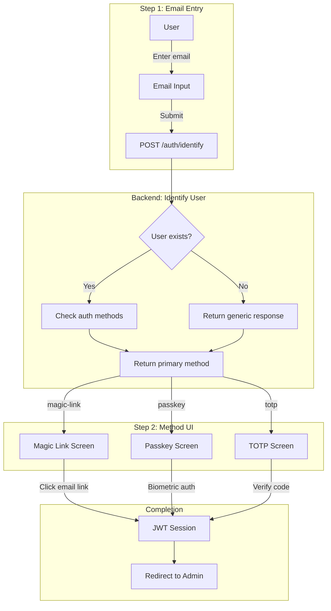

# Decision: Two-Step Passwordless Authentication Flow

## Context

The Publisher CMS previously used a tabbed login interface where users could choose between password, magic link, passkey, or TOTP authentication methods. This approach had several issues:

- **Cognitive overhead**: Users had to decide which auth method to use before knowing what they had configured
- **Password security burden**: Maintaining password authentication required ongoing security vigilance (hash upgrades, breach detection, password policies)
- **Inconsistent UX**: Different methods had different entry points and flows
- **Feature flag complexity**: `requirePasswordless` flag existed but passwords remained available

The existing passwordless infrastructure (magic links, WebAuthn, TOTP) was mature enough to become the primary authentication method.

## Decision

We removed password authentication entirely and implemented a **two-step passwordless login flow**:

1. **Step 1**: User enters email only
2. **Step 2**: System presents the appropriate authentication method based on user's configuration

Password login now returns **410 Gone** with a deprecation message.

## Architecture



## Rationale

- **User experience**: Single email field reduces friction; system auto-detects the best method
- **Security posture**: Eliminating passwords removes an entire attack surface (credential stuffing, password reuse, brute force)
- **Code maintainability**: Simpler codebase without password verification, hashing upgrades, and policy enforcement
- **Industry alignment**: Passwordless authentication is becoming the standard (passkeys, WebAuthn adoption)

## Consequences

### Positive
- Cleaner, more intuitive login UX
- Reduced attack surface (no password-related vulnerabilities)
- Simpler codebase maintenance
- Phishing-resistant options (passkeys) prioritized
- Consistent timing prevents email enumeration attacks

### Negative
- Existing password users must migrate (forced magic link first login)
- Requires email delivery infrastructure
- Some users may be confused by the change initially

### Neutral
- `requirePasswordless` flag now defaults to `true`
- Password field remains in database for migration tracking
- `hasPassword` flag returned by identify endpoint for informational purposes

## API Changes

### New Endpoint

```
POST /api/publisher/auth/identify
```

Identifies user by email and returns available authentication methods.

**Request:**
```json
{
  "email": "user@example.com"
}
```

**Response:**
```json
{
  "email": "user@example.com",
  "method": "passkey",
  "availableMethods": ["passkey", "magic-link"],
  "hasPassword": true
}
```

- Rate limited: 5 requests per email per hour
- Returns generic magic-link response for unknown emails (prevents enumeration)
- Minimum 100ms response time to mask timing differences

### Deprecated Endpoint

```
POST /api/publisher/auth/login
```

Returns **410 Gone**:
```json
{
  "error": {
    "message": "Password login has been deprecated. Please use passwordless authentication.",
    "code": "PASSWORD_DEPRECATED"
  }
}
```

## Migration Path for Existing Password Users

1. **Identification**: When `requirePasswordless: true`, password-only users receive `magic-link` as their primary method
2. **First Login**: User receives magic link email to verify identity
3. **Post-Login**: User can set up passkey or TOTP from security settings
4. **Backward Compatibility**: Set `requirePasswordless: false` to temporarily allow password login during migration

## Alternatives Considered

1. **Keep password as fallback** — Rejected because it maintains the security burden and creates inconsistent UX
2. **Gradual opt-in migration** — Rejected because it prolongs the transition and keeps complexity
3. **Force immediate migration** — Rejected because it would lock out users without email access

## Related

- [Passwordless Authentication Analysis](./2026-03-01-passwordless-authentication-analysis.md) — Original analysis and recommendation
- [Authentication Architecture](./2026-02-28-authentication-architecture.md) — JWT and API token implementation

## Related Files

- `server/api/publisher/auth/identify.post.ts`
- `server/api/publisher/auth/login.post.ts`
- `app/pages/admin/login.vue`
- `app/composables/usePublisherAuth.ts`
