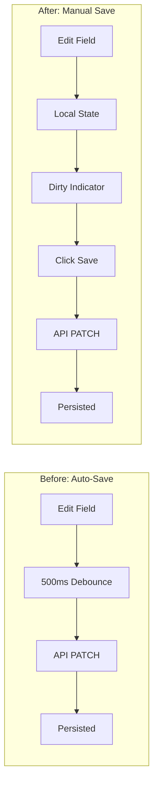

# Decision: Manual Save vs Auto-Save for Block Editing

## Context

The Page Builder originally auto-saved block content changes with a 500ms debounce. Every keystroke or field change triggered an API PATCH request after a short delay. This approach had several issues:

- **No undo mechanism** — Changes were persisted immediately
- **Accidental modifications** — Clicking into a field and typing saved instantly
- **User uncertainty** — No clear feedback about what was saved vs pending
- **Network overhead** — Many API calls for minor edits

## Decision

Replace auto-save with **explicit manual save** for block content edits. Users must click "Save Changes" to persist modifications.

## Architecture

## Rationale

- **User control** — Users decide when their changes are "ready" to save
- **Accidental edit protection** — No more unintended modifications
- **Clear mental model** — Explicit action = explicit result
- **Reduced API calls** — One save instead of many debounced saves
- **Navigation protection** — Browser warns before losing unsaved work

## Consequences

### Positive
- Users have full control over when changes persist
- Clear visual feedback with warning banner and button state
- Fewer unnecessary API calls
- Navigation protection prevents accidental data loss
- Matches common UX patterns (Google Docs, Notion, etc.)

### Negative
- Extra click required to save changes
- Users may forget to save (mitigated by warning banner + navigation protection)
- Slight learning curve for users accustomed to auto-save

### Neutral
- Structural changes (add/delete/reorder) still auto-save immediately
- Only content edits require manual save

## Alternatives Considered

1. **Keep auto-save with longer debounce (2-3 seconds)**
   - Rejected: Still doesn't give users explicit control
   - Rejected: Unclear when changes are "committed"

2. **Hybrid approach: auto-save with "Save" button for confirmation**
   - Rejected: Confusing mental model (what does the button do if already saved?)
   - Rejected: Two sources of truth for "saved" state

3. **Draft mode with explicit publish**
   - Rejected: Overly complex for block-level content
   - Rejected: Adds workflow overhead for simple edits

4. **Per-field auto-save with visual indicators**
   - Rejected: Too granular, creates "saving..." noise
   - Rejected: Doesn't solve the accidental edit problem

## Implementation Details

- **Dirty state**: Tracked per block in `dirtyBlockIds` Set
- **UI feedback**: Amber warning banner + disabled save button when clean
- **Navigation protection**: `beforeunload` event shows browser confirmation
- **API**: Same PATCH endpoint, just triggered by button instead of watcher

## Related Decisions

- Structural changes (add/delete/reorder blocks) remain immediate operations
- Page metadata (title, slug, SEO) has separate save flow

## Related Files

- `app/components/publisher/BlockSettings.vue`
- `app/composables/usePageBuilder.ts`
