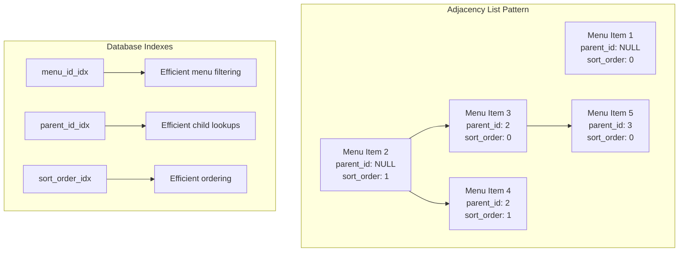

# Decision: Menu Hierarchy Pattern

## Context

The Menu System needed a way to store and retrieve hierarchical menu items with support for arbitrary depth nesting. The system requires efficient tree traversal for public API responses, easy reordering of items, and the ability to move items between parents.

Several patterns exist for storing hierarchical data in relational databases:
1. **Adjacency List** - Each row stores a parent_id reference
2. **Nested Sets** - Left/right values define position in tree
3. **Materialized Path** - Full path stored as string (e.g., "1.4.7")
4. **Closure Table** - Separate table stores all ancestor-descendant relationships

## Decision

We chose the **Adjacency List pattern** with a `parent_id` column and separate `sort_order` column for the menu items table.

## Architecture

## Rationale

### Why Adjacency List?

1. **Simplicity** - Easy to understand and implement. A single `parent_id` column is intuitive.

2. **Efficient for our use case** - Menus typically have <200 items total, making in-memory tree building fast enough.

3. **Easy reordering** - Simply update `sort_order` values. No complex tree recalculation like nested sets.

4. **Flexible depth** - Supports arbitrary nesting without schema changes.

5. **Clear ownership** - Each item belongs to exactly one parent (or root).

### Why Not Alternatives?

| Pattern | Rejected Because |
|----------|-----------------|
| **Nested Sets** | Complex to maintain on inserts/moves/deletes. Requires recalculating left/right values for many rows. Overkill for small trees. |
| **Materialized Path** | Path strings can become unwieldy. Sorting by path requires careful padding. Less intuitive queries. |
| **Closure Table** | Additional table adds complexity. More joins required. Overkill for our read-heavy, small-tree use case. |

### Why Separate Tables (Not Content Type)?

Menus are stored as dedicated system tables (`publisher_menus`, `publisher_menu_items`) rather than as a dynamic content type:

1. **Specialized queries** - Hierarchical tree building requires custom SQL that doesn't fit standard content type patterns.

2. **Custom admin UI** - Menu builder with drag-and-drop requires specialized components not applicable to other content types.

3. **Performance** - Direct table access without content type abstraction layer overhead.

4. **Referential integrity** - Foreign key from menu items to pages ensures valid page references.

### Why Three Item Types?

| Type | Use Case |
|------|----------|
| **page** | Internal navigation to CMS pages. Stores page ID, resolves to URL at runtime so links stay valid if page slug changes. |
| **external** | Links to external sites. Requires full URL. |
| **label** | Non-clickable headers for dropdown menus or section grouping. No URL needed. |

These three cover all common navigation patterns without over-engineering.

## Consequences

### Positive
- Simple schema that developers can easily understand
- Fast reads for typical menu sizes (<200 items)
- Easy to implement reordering via sort_order updates
- Supports unlimited nesting depth
- Page ID references keep links valid when slugs change

### Negative
- Requires in-memory tree building (fetch all items, then assemble tree)
- No database-level circular reference prevention
- Subtree queries require application-level traversal
- Performance degrades with very large menus (500+ items)

### Neutral
- Tree building happens in application code, not SQL
- Indexes on parent_id and sort_order are essential for performance
- Move operations require updating only the moved item's parent_id

## Alternatives Considered

1. **Recursive CTEs for tree building** — PostgreSQL supports recursive CTEs for building trees in SQL, but SQLite support is limited. We chose in-memory building for database compatibility.

2. **Nested sets with left/right values** — Considered for efficient subtree queries, but rejected due to complexity of maintaining values during updates.

3. **Storing menus as JSON in content types** — Would simplify schema but lose referential integrity and query flexibility.

## Related

- [Menu System Feature](../features/2026-03-08-menu-system.md)
- [Menu API Flow](../flows/2026-03-08-menu-api-flow.md)

## Related Files

- `server/utils/publisher/database/schema/postgres.ts`
- `server/api/v1/menus/[slug].get.ts`
