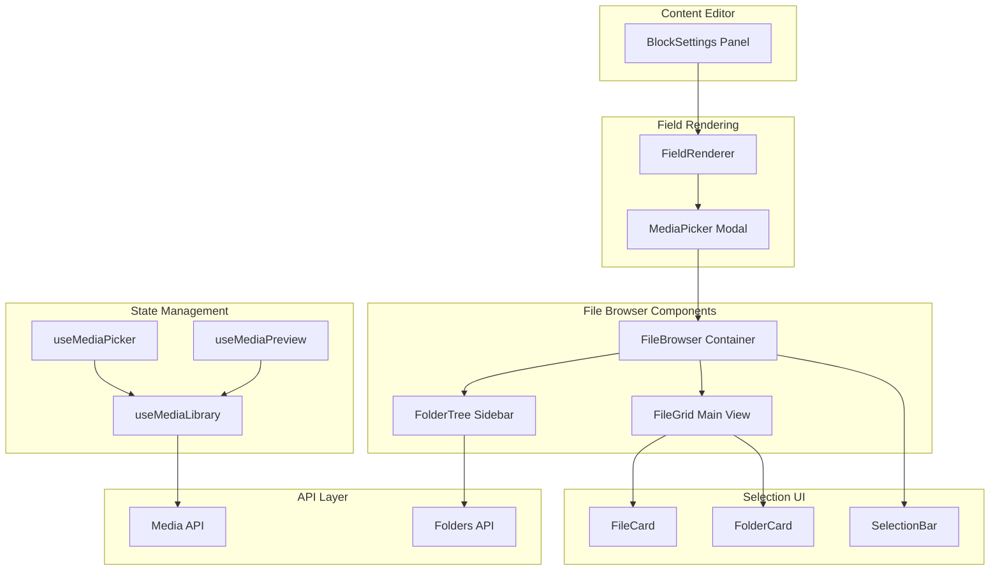

# Feature: MediaPicker - File Manager Integration

## Overview

The MediaPicker is a modal-based file browser that integrates the Publisher CMS File Manager with `image` and `image-gallery` content blocks. It enables content editors to visually browse, search, and select images directly from the media library instead of manually entering media IDs.

This feature bridges the gap between the File Manager backend and the content editing experience, providing a seamless workflow for media selection.

## Architecture



## Key Components

| Component | File | Purpose |
|-----------|------|---------|
| MediaPicker | `components/media/MediaPicker.vue` | Modal wrapper that orchestrates the file selection workflow |
| FileBrowser | `components/media/FileBrowser.vue` | Main container for folder navigation and file display |
| FolderTree | `components/media/FolderTree.vue` | Hierarchical folder navigation sidebar |
| FileGrid | `components/media/FileGrid.vue` | Grid layout for displaying files and folders |
| FileCard | `components/media/FileCard.vue` | Individual file item with preview and selection |
| FolderCard | `components/media/FolderCard.vue` | Folder item for navigation |
| SelectionBar | `components/media/SelectionBar.vue` | Footer bar with confirm/cancel actions |

## Composables

| Composable | Purpose |
|------------|---------|
| `useMediaLibrary` | Fetches and manages media files from the API |
| `useMediaPicker` | Handles selection state, multi-select logic, and emits selections |
| `useMediaPreview` | Generates preview URLs and handles image optimization |

## Supported Block Types

- **`image`** - Single image selection
- **`image-gallery`** - Multiple image selection with ordering

## Usage

The MediaPicker is automatically invoked when a content editor interacts with an image field in the BlockSettings panel:

1. Editor clicks on an image field
2. FieldRenderer opens the MediaPicker modal
3. Editor browses folders and selects images
4. Selection is confirmed and passed back to the block

```typescript
// Example: Opening the MediaPicker from a field
const { openPicker } = useMediaPicker({
  multiple: false,  // or true for galleries
  onSelect: (media) => {
    field.value = media.id
  }
})
```

## Configuration

The MediaPicker respects the following configuration options:

| Option | Type | Default | Description |
|--------|------|---------|-------------|
| `multiple` | boolean | false | Allow multiple file selection |
| `accept` | string[] | ['image/*'] | Accepted MIME types |
| `maxSelect` | number | 50 | Maximum files selectable in multi-mode |

## API Endpoints

| Endpoint | Method | Purpose |
|----------|--------|---------|
| `/api/media` | GET | List media files with pagination and filtering |
| `/api/media/:id` | GET | Get single media item details |
| `/api/folders` | GET | List folders with hierarchy |
| `/api/folders/:id/media` | GET | List media in a specific folder |

## Limitations

- Currently supports only image MIME types
- Folder creation/deletion must be done through the main File Manager
- Large galleries (50+ images) may experience performance degradation in the picker


## Related Files

- `components/media/MediaPicker.vue`
- `components/media/FileBrowser.vue`
- `composables/useMediaPicker.ts`
