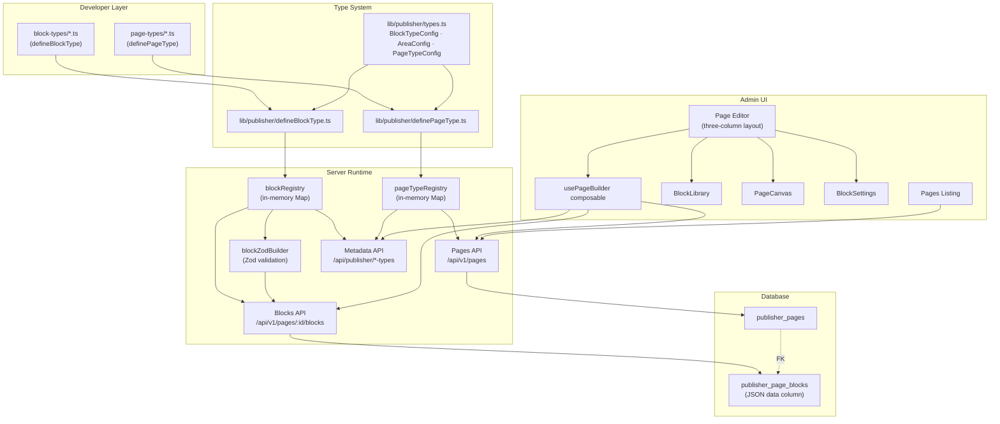

# Feature: Page Builder — Pages, Page Types, Areas & Content Blocks

## Overview

The Page Builder is a composable page-editing system for Publisher CMS. It allows content editors to create pages from predefined **Page Types** (templates), each of which defines named **Areas** (zones) that accept specific **Block Types** (reusable content components). Editors assemble pages by dragging blocks into areas, configuring each block's fields, and publishing when ready.

The system ships with **18 block types** (rich-text, heading, quote, image, image-gallery, video, hero, feature-grid, cta, button-group, spacer, divider, accordion, card-grid, stats, logo-grid, code, html) and **3 page types** (landing-page, blog-page, marketing-page). Both are fully extensible — developers add new block types or page types by dropping a single TypeScript file into the `block-types/` or `page-types/` directory.

## Architecture



## Key Components

| Component | File | Purpose |
|-----------|------|---------|
| Type definitions | `lib/publisher/types.ts` | `BlockTypeConfig`, `AreaConfig`, `PageTypeConfig`, `PageBlock` interfaces |
| `defineBlockType()` | `lib/publisher/defineBlockType.ts` | Declarative block type definition with validation |
| `definePageType()` | `lib/publisher/definePageType.ts` | Declarative page type definition with area validation |
| Block registry | `server/utils/publisher/blockRegistry.ts` | In-memory `Map<string, BlockTypeConfig>` populated at startup |
| Page type registry | `server/utils/publisher/pageTypeRegistry.ts` | In-memory `Map<string, PageTypeConfig>` populated at startup |
| Block Zod builder | `server/utils/publisher/blockZodBuilder.ts` | Builds & caches Zod schemas from block field definitions for request validation |
| Database schema | `server/utils/publisher/db.ts` | `publisher_pages` and `publisher_page_blocks` Drizzle table definitions |
| `usePageBuilder` | `app/composables/usePageBuilder.ts` | Vue composable — single source of truth for editor state, optimistic updates, debounced saves |
| Block Library | `app/components/publisher/BlockLibrary.vue` | Left panel — searchable, categorized block picker filtered by area constraints |
| Page Canvas | `app/components/publisher/PageCanvas.vue` | Center panel — renders areas with blocks, supports drag-and-drop reordering (sortablejs) |
| Block Settings | `app/components/publisher/BlockSettings.vue` | Right panel — dynamic form for editing the selected block's fields |
| Block Preview | `app/components/publisher/BlockPreview.vue` | Styled read-only block rendering for Preview mode |
| Page editor | `app/pages/admin/pages/[id].vue` | Full editor page with top bar, three-column layout, settings slideover |

## Defining Custom Block Types

Create a file in `block-types/` and export a `defineBlockType()` call. The Nitro server plugin auto-discovers and registers it at startup.

```ts
// block-types/testimonial.ts
import { defineBlockType } from '~/lib/publisher/defineBlockType'

export default defineBlockType({
  name: 'testimonial',
  displayName: 'Testimonial',
  icon: 'i-heroicons-chat-bubble-left-right',
  category: 'text',
  description: 'A customer testimonial with quote, author, and avatar',
  fields: {
    quote:      { type: 'richtext', required: true, label: 'Quote' },
    authorName: { type: 'string', required: true, label: 'Author Name' },
    authorRole: { type: 'string', label: 'Author Role' },
    avatar:     { type: 'media', label: 'Author Avatar' },
    rating:     { type: 'number', min: 1, max: 5, label: 'Star Rating' },
  },
})
```

Supported field types: `string`, `text`, `richtext`, `number`, `boolean`, `date`, `datetime`, `uid`, `media`, `relation`, `enum`, `json`, `email`, `password`.

## Defining Custom Page Types

Create a file in `page-types/` and export a `definePageType()` call. Each page type declares named areas with `allowedBlocks` constraints.

```ts
// page-types/product-page.ts
import { definePageType } from '~/lib/publisher/definePageType'

export default definePageType({
  name: 'product-page',
  displayName: 'Product Page',
  icon: 'i-heroicons-shopping-bag',
  description: 'Product showcase with hero, details, and related content',
  areas: {
    hero: {
      name: 'hero',
      displayName: 'Hero Area',
      allowedBlocks: ['hero', 'image'],
      maxBlocks: 1,
    },
    details: {
      name: 'details',
      displayName: 'Product Details',
      allowedBlocks: ['rich-text', 'heading', 'image-gallery', 'video', 'accordion'],
    },
    related: {
      name: 'related',
      displayName: 'Related Content',
      allowedBlocks: ['card-grid', 'cta'],
      maxBlocks: 2,
    },
  },
  options: {
    draftAndPublish: true,
    timestamps: true,
    softDelete: true,
    seo: true,
  },
})
```

Area constraints (`allowedBlocks`, `minBlocks`, `maxBlocks`) are enforced both server-side (API validation) and client-side (Block Library filtering).

## Shipped Block Types (18)

| Block Type | Category | Description |
|------------|----------|-------------|
| `rich-text` | text | Formatted text with rich text editing |
| `heading` | text | Section heading (h1–h6) |
| `quote` | text | Blockquote with attribution |
| `image` | media | Single image with alt text and caption |
| `image-gallery` | media | Multi-image gallery |
| `video` | media | Embedded video (URL-based) |
| `hero` | hero | Full-width hero banner with headline, CTA, background |
| `feature-grid` | layout | Grid of feature cards with icons |
| `cta` | cta | Call-to-action section |
| `button-group` | cta | Group of action buttons |
| `spacer` | layout | Vertical spacing |
| `divider` | layout | Horizontal divider line |
| `accordion` | layout | Expandable FAQ / accordion sections |
| `card-grid` | data | Grid of content cards |
| `stats` | data | Statistics / metrics display |
| `logo-grid` | data | Grid of partner/client logos |
| `code` | embed | Syntax-highlighted code block |
| `html` | embed | Raw HTML embed |

## Shipped Page Types (3)

| Page Type | Areas | Description |
|-----------|-------|-------------|
| `landing-page` | hero · content · cta | Versatile landing page with hero, content, and call-to-action |
| `blog-page` | header · body · sidebar | Blog post layout with header, body content, and sidebar |
| `marketing-page` | hero · features · content · footer-cta | Marketing page with hero, features, content, and footer CTA |

## API Reference

All page endpoints require JWT authentication for write operations. Public (unauthenticated) requests only see published pages.

### Pages CRUD

| Method | Endpoint | Description |
|--------|----------|-------------|
| `GET` | `/api/v1/pages` | List pages (paginated, filterable by `status`, `pageType`, `search`, `sort`) |
| `POST` | `/api/v1/pages` | Create a page (`{ title, pageType, slug?, status?, meta* }`) |
| `GET` | `/api/v1/pages/:id` | Get page with all blocks grouped by area |
| `PATCH` | `/api/v1/pages/:id` | Update page metadata (title, slug, status, SEO fields) |
| `DELETE` | `/api/v1/pages/:id` | Soft-delete a page |

### Blocks CRUD

| Method | Endpoint | Description |
|--------|----------|-------------|
| `GET` | `/api/v1/pages/:id/blocks` | List all blocks for a page |
| `POST` | `/api/v1/pages/:id/blocks` | Add a block (`{ areaName, blockType, data?, sortOrder? }`) |
| `PATCH` | `/api/v1/pages/:id/blocks/:blockId` | Update block data |
| `DELETE` | `/api/v1/pages/:id/blocks/:blockId` | Delete a block |
| `POST` | `/api/v1/pages/:id/blocks/reorder` | Reorder blocks (`{ area, blockIds: number[] }`) |

### Metadata (Admin)

| Method | Endpoint | Description |
|--------|----------|-------------|
| `GET` | `/api/publisher/page-types` | List all registered page types with area configs |
| `GET` | `/api/publisher/block-types` | List all registered block types with field definitions |

### Example: Create a page and add a block

```bash
# 1. Create a landing page
curl -X POST /api/v1/pages \
  -H "Authorization: Bearer $TOKEN" \
  -d '{ "title": "Summer Sale", "pageType": "landing-page" }'
# → { "data": { "id": 1, "slug": "summer-sale", "status": "draft", ... } }

# 2. Add a hero block to the hero area
curl -X POST /api/v1/pages/1/blocks \
  -H "Authorization: Bearer $TOKEN" \
  -d '{
    "areaName": "hero",
    "blockType": "hero",
    "data": {
      "headline": "Summer Sale — 50% Off",
      "subtitle": "Limited time offer",
      "ctaText": "Shop Now",
      "ctaUrl": "/shop"
    }
  }'
```

## Admin UI Workflow

The page editor uses a **three-column layout** accessible at `/admin/pages/:id`:

```mermaid
sequenceDiagram
    participant Editor as Content Editor
    participant List as Pages Listing
    participant Create as Create Page Dialog
    participant UI as Page Editor (3-column)
    participant API as Server API

    Editor->>List: Navigate to /admin/pages
    List->>API: GET /api/v1/pages
    API-->>List: Paginated page list

    Editor->>Create: Click "New Page"
    Create->>API: POST /api/v1/pages { title, pageType }
    API-->>Create: Created page (draft)
    Create->>UI: Redirect to /admin/pages/:id

    UI->>API: GET /api/v1/pages/:id (page + blocks)
    UI->>API: GET /api/publisher/page-types
    UI->>API: GET /api/publisher/block-types
    API-->>UI: Page data, type configs

    Note over UI: Three-column layout loads

    Editor->>UI: Click area "+" button (left: BlockLibrary)
    Note over UI: BlockLibrary filters to allowed blocks for area
    Editor->>UI: Click block type to add
    UI->>API: POST /api/v1/pages/:id/blocks
    API-->>UI: New block created

    Editor->>UI: Click block in canvas (center: PageCanvas)
    Note over UI: BlockSettings panel (right) shows fields
    Editor->>UI: Edit block fields
    UI->>API: PATCH /api/v1/pages/:id/blocks/:blockId (debounced 500ms)

    Editor->>UI: Drag block to reorder
    UI->>API: POST /api/v1/pages/:id/blocks/reorder

    Editor->>UI: Toggle Edit → Preview mode
    Note over UI: BlockLibrary + BlockSettings hide; BlockPreview renders

    Editor->>UI: Click "Publish"
    UI->>API: PATCH /api/v1/pages/:id { status: "published" }
```

### Editor Panels

1. **Block Library** (left, 240px) — Searchable, categorized list of available block types. Filters automatically based on the selected area's `allowedBlocks` constraint. Click a block type to add it to the active area.

2. **Page Canvas** (center, flexible) — Renders all areas defined by the page type. Each area shows its blocks in order with drag-and-drop reordering via sortablejs. Click a block to select it; click the "+" button on an area to activate the Block Library for that area.

3. **Block Settings** (right, panel) — Dynamic form generated from the selected block type's field definitions. Changes are applied optimistically to the UI and persisted via debounced API calls (500ms delay).

4. **Top Bar** — Editable page title, status badge (draft/published), Edit/Preview toggle, Save button, Publish/Unpublish button, and Settings gear (opens SEO slideover).

5. **Settings Slideover** — URL slug editor (with change warning), SEO fields (meta title, meta description, OG image, custom meta JSON).

## Configuration

- **Database**: SQLite via Drizzle ORM (`publisher_pages` + `publisher_page_blocks` tables)
- **Block data storage**: JSON column in `publisher_page_blocks.data`
- **Authentication**: JWT-based (same as content API)
- **Drag & drop**: sortablejs library
- **Validation**: Zod schemas auto-generated from block type field definitions, cached per block type

## Limitations

- **No cross-area block moves** — Blocks cannot be dragged between areas; they must be deleted and re-created
- **No block versioning** — Block data changes are immediate; there is no revision history
- **No webhook support for page events** — The webhook system currently only supports content type events; page event support is planned
- **No nested blocks** — Blocks are flat within an area; blocks cannot contain other blocks
- **Single-level areas** — Areas cannot be nested within other areas
- **No collaborative editing** — Only one editor can work on a page at a time (no real-time sync)


## Related Files

- `lib/publisher/types.ts`
- `lib/publisher/defineBlockType.ts`
- `lib/publisher/definePageType.ts`
- `server/utils/publisher/blockRegistry.ts`
- `server/utils/publisher/pageTypeRegistry.ts`
- `server/utils/publisher/blockZodBuilder.ts`
- `server/utils/publisher/db.ts`
- `server/api/v1/pages/index.get.ts`
- `server/api/v1/pages/index.post.ts`
- `server/api/v1/pages/[id].get.ts`
- `server/api/v1/pages/[id].patch.ts`
- `server/api/v1/pages/[id].delete.ts`
- `server/api/v1/pages/[id]/blocks/index.get.ts`
- `server/api/v1/pages/[id]/blocks/index.post.ts`
- `server/api/v1/pages/[id]/blocks/[blockId].patch.ts`
- `server/api/v1/pages/[id]/blocks/[blockId].delete.ts`
- `server/api/v1/pages/[id]/blocks/reorder.post.ts`
- `server/api/publisher/page-types/index.get.ts`
- `server/api/publisher/block-types/index.get.ts`
- `app/composables/usePageBuilder.ts`
- `app/pages/admin/pages/index.vue`
- `app/pages/admin/pages/new.vue`
- `app/pages/admin/pages/[id].vue`
- `app/components/publisher/BlockLibrary.vue`
- `app/components/publisher/PageCanvas.vue`
- `app/components/publisher/BlockSettings.vue`
- `app/components/publisher/BlockInstance.vue`
- `app/components/publisher/BlockPreview.vue`
- `block-types/hero.ts`
- `block-types/rich-text.ts`
- `page-types/landing-page.ts`
- `page-types/blog-page.ts`
- `page-types/marketing-page.ts`
