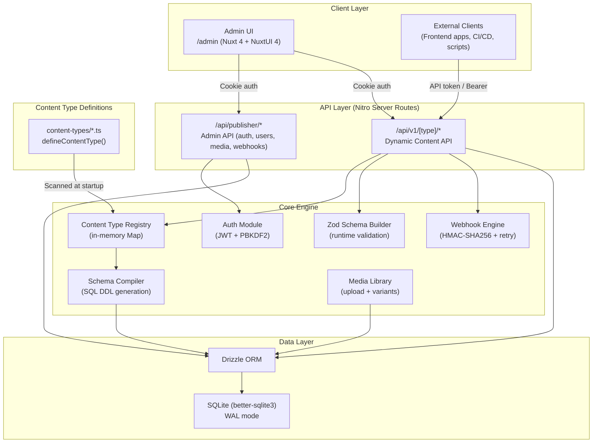

# Feature: Publisher CMS

## Overview

Publisher is a developer-first headless CMS built entirely as a Nuxt 4 application. It provides a complete content management system with an admin UI, auto-generated REST APIs, code-first content type definitions, JWT authentication, media management, and webhook integrations — all running on SQLite via Drizzle ORM with zero external service dependencies.

The system is designed around a single guiding principle: **define your content types in code, and Publisher generates everything else** — database tables, API endpoints, validation schemas, and admin UI forms.

## Architecture



## Key Components

| Component | File(s) | Purpose |
|-----------|---------|---------|
| Content Type API | `lib/publisher/defineContentType.ts` | Declarative content type definition with validation |
| Type System | `lib/publisher/types.ts` | TypeScript interfaces for 14 field types and content type config |
| Content Type Registry | `server/utils/publisher/registry.ts` | In-memory Map storing registered content types, lookup by name or plural |
| Schema Compiler | `server/utils/publisher/schemaCompiler.ts` | Converts content type configs to SQL `CREATE TABLE` statements (`publisher_ct_` prefix) |
| Zod Builder | `server/utils/publisher/zodBuilder.ts` | Generates Zod validation schemas from content type field definitions at runtime |
| Content API Helpers | `server/utils/publisher/contentApi.ts` | Request auth checks, content type resolution, snake_case ↔ camelCase conversion |
| Auth Module | `server/utils/publisher/auth.ts` | PBKDF2-SHA512 password hashing, JWT creation/verification (jose), API token generation |
| Webhook Engine | `server/utils/publisher/webhooks.ts` | HMAC-SHA256 signed webhook dispatch with 3-attempt retry (0s, 30s, 5min) |
| Slug Generator | `server/utils/publisher/slug.ts` | Auto-generates unique URL slugs for `uid` fields from a target field |
| Database Layer | `server/utils/publisher/db.ts` | Drizzle ORM + better-sqlite3 singleton with 6 system tables (`publisher_` prefix) |
| Dynamic Content Routes | `server/api/v1/[type]/` | GET (list), POST (create), GET/:id, PUT/:id, PATCH/:id, DELETE/:id |
| Admin API Routes | `server/api/publisher/` | Auth, users, media, tokens, types, webhooks management |
| Admin UI | `app/pages/admin/` | Dashboard, content management, media library, settings (NuxtUI 4) |
| CMS Config | `publisher.config.ts` | Central configuration: auth, uploads, pagination, roles |

## Usage

### Defining Content Types

Create a file in `content-types/` using `defineContentType()`:

```typescript
// content-types/article.ts
import { defineContentType } from '../lib/publisher/defineContentType'

export default defineContentType({
  name: 'article',
  displayName: 'Article',
  pluralName: 'articles',
  icon: 'i-heroicons-document-text',
  description: 'Blog posts and articles',
  options: {
    draftAndPublish: true,   // Adds status + publishedAt fields
    timestamps: true,         // Adds createdAt + updatedAt fields
    softDelete: true,         // Adds deletedAt field
  },
  fields: {
    title:   { type: 'string', required: true, maxLength: 255, label: 'Title' },
    slug:    { type: 'uid', targetField: 'title', label: 'Slug' },
    body:    { type: 'richtext', label: 'Body' },
    excerpt: { type: 'text', label: 'Excerpt', hint: 'A short summary' },
  },
})
```

At server startup, Publisher scans `content-types/`, registers each type in the in-memory registry, and auto-creates the corresponding `publisher_ct_articles` table.

### Supported Field Types

| Type | SQL Mapping | Notes |
|------|-------------|-------|
| `string` | `VARCHAR(n)` / `TEXT` | Supports `maxLength`, `minLength` |
| `text` | `TEXT` | Plain text |
| `richtext` | `TEXT` | Rich text / HTML |
| `number` | `INTEGER` | Supports `min`, `max` |
| `boolean` | `INTEGER` | 0/1 in SQLite |
| `date` / `datetime` | `TEXT` | ISO 8601 strings |
| `uid` | `TEXT UNIQUE` | Auto-generated slug from `targetField` |
| `media` | `INTEGER` | Foreign key to `publisher_media` |
| `relation` | `INTEGER` / `TEXT` | FK for oneToOne/manyToOne, JSON array for *ToMany |
| `enum` | `TEXT` | Validated against `options` array |
| `json` | `TEXT` | Arbitrary JSON stored as string |
| `email` | `TEXT` | Validated with Zod `.email()` |
| `password` | `TEXT` | Validated as non-empty string |

### Content API

All content types are automatically exposed at `/api/v1/{pluralName}`:

```bash
# List entries (public — only published if draftAndPublish is enabled)
GET /api/v1/articles?pagination[page]=1&pagination[pageSize]=25&sort=createdAt:DESC

# Filter entries
GET /api/v1/articles?filters[title][$contains]=nuxt&filters[status]=published

# Get single entry
GET /api/v1/articles/42

# Create entry (requires auth)
POST /api/v1/articles
Authorization: Bearer <api-token>
{ "title": "Hello World", "body": "<p>Content here</p>" }

# Update entry (requires auth)
PUT /api/v1/articles/42
PATCH /api/v1/articles/42

# Delete entry (requires auth)
DELETE /api/v1/articles/42
```

**Filter operators:** `$contains`, `$gt`, `$gte`, `$lt`, `$lte`, `$ne`, or exact match (no operator).

### Admin API

| Endpoint | Purpose |
|----------|---------|
| `POST /api/publisher/auth/login` | Login with email/password, sets httpOnly cookie |
| `POST /api/publisher/auth/logout` | Revokes JWT, clears cookie |
| `GET /api/publisher/auth/me` | Current user profile |
| `GET/POST /api/publisher/users/` | User management |
| `GET/POST /api/publisher/media/` | Media upload and listing |
| `GET/POST /api/publisher/tokens/` | API token management |
| `GET/POST /api/publisher/webhooks/` | Webhook configuration |
| `GET /api/publisher/types/` | List registered content types |

## Configuration

The `publisher.config.ts` file controls CMS behavior:

```typescript
export default {
  appName: 'Publisher',
  defaultAdmin: { email: 'admin@publisher.local', password: 'admin' },
  auth: {
    tokenExpiry: '7d',
    cookieName: 'publisher-session',
    saltRounds: 12,
  },
  uploads: {
    maxFileSize: 10 * 1024 * 1024,  // 10MB
    allowedMimeTypes: ['image/jpeg', 'image/png', 'image/webp', ...],
    imageSizes: { thumbnail: 245, small: 500, medium: 750, large: 1000 },
  },
  pagination: { defaultPageSize: 25, maxPageSize: 100 },
  roles: {
    'super-admin': { label: 'Super Admin', description: 'Full access' },
    admin:         { label: 'Admin', description: 'All content CRUD, manage users' },
    editor:        { label: 'Editor', description: 'Create/edit own entries' },
    viewer:        { label: 'Viewer', description: 'Read-only access' },
  },
}
```

**Environment variables:**
- `PUBLISHER_SECRET` — JWT signing secret (required in production)
- `DATABASE_URL` — SQLite database path (defaults to `.data/publisher.db`)

## Database Schema

System tables use the `publisher_` prefix:

| Table | Purpose |
|-------|---------|
| `publisher_users` | Admin users with roles |
| `publisher_revoked_tokens` | JWT blocklist for logout/revocation |
| `publisher_api_tokens` | Programmatic API tokens (hashed) |
| `publisher_media` | Uploaded media files with variants |
| `publisher_webhooks` | Webhook configurations |
| `publisher_webhook_logs` | Webhook delivery audit log |

Content type tables use the `publisher_ct_` prefix (e.g., `publisher_ct_articles`).

## Limitations

- **SQLite only** — No PostgreSQL/MySQL support yet; designed for single-server deployments
- **No real-time** — No WebSocket subscriptions for live content updates
- **No i18n** — Content localization is not built-in
- **No content versioning** — No revision history or rollback capability
- **Relations are app-level** — Many-to-many relations stored as JSON arrays, not junction tables
- **Single-node** — WAL mode helps concurrency but SQLite is not designed for multi-server writes

## Related Files

- `lib/publisher/types.ts`
- `lib/publisher/defineContentType.ts`
- `publisher.config.ts`
- `server/utils/publisher/db.ts`
- `server/utils/publisher/registry.ts`
- `server/utils/publisher/schemaCompiler.ts`
- `server/utils/publisher/zodBuilder.ts`
- `server/utils/publisher/contentApi.ts`
- `server/api/v1/[type]/index.get.ts`
- `server/api/v1/[type]/index.post.ts`
