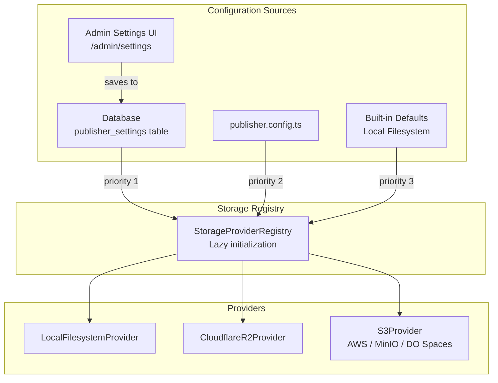

# Storage Configuration Guide

Publisher CMS supports multiple storage backends for media files. You can switch between providers at any time via the Admin Settings UI or by editing configuration files.

## Supported Providers

| Provider | Best For | Egress Fees | Setup Complexity |
|----------|----------|-------------|------------------|
| **Local Filesystem** | Development, single-server | None | Minimal |
| **Cloudflare R2** | Production, zero egress | None | Medium |
| **AWS S3** | Production, AWS ecosystem | Per-GB | Medium |
| **MinIO** | Self-hosted, S3-compatible | None | Medium |
| **DigitalOcean Spaces** | Simple cloud storage | Per-GB | Low |

## Architecture



## Quick Start

### Option 1: Admin Settings UI (Recommended)

1. Log in to the Publisher admin panel
2. Navigate to **Settings** → **Storage** tab
3. Select your desired storage provider
4. Fill in the required configuration fields
5. Click **Test Connection** to verify credentials
6. Click **Save Configuration**

### Option 2: Configuration File

Edit `publisher.config.ts` and uncomment the desired provider in the `storage.providers` section.

### Option 3: Environment Variables

Set variables in your `.env` file. See `.env.example` for all available options.

## Provider Setup Guides

### Local Filesystem (Default)

The local filesystem provider stores files on the server's disk. This is the default and requires no configuration.

**Configuration:**
- `basePath`: Directory for file storage (default: `./public/uploads`)
- `baseUrl`: URL path for serving files (default: `/uploads`)

**Environment Variables:**
```env
PUBLISHER_UPLOAD_DIR=./public/uploads
PUBLISHER_UPLOAD_URL=/uploads
```

**Limitations:**
- Not suitable for multi-server deployments
- Files are lost if the server disk is wiped
- No CDN integration

---

### AWS S3

**Prerequisites:**
- AWS account
- S3 bucket created
- IAM user with appropriate permissions

**Step-by-Step Setup:**

1. **Create an S3 Bucket:**
   - Go to AWS Console → S3 → Create bucket
   - Choose a region close to your server
   - Enable or disable public access based on your needs

2. **Create IAM Credentials:**
   - Go to IAM → Users → Create user
   - Attach policy with these permissions:
     - `s3:PutObject`, `s3:GetObject`, `s3:DeleteObject`, `s3:ListBucket`
   - Create access keys under Security credentials

3. **Configure Publisher:**
   ```env
   AWS_ACCESS_KEY_ID=your-access-key
   AWS_SECRET_ACCESS_KEY=your-secret-key
   AWS_S3_BUCKET=your-bucket-name
   AWS_REGION=us-east-1
   ```

4. **Optional: CloudFront CDN**
   - Create a CloudFront distribution pointing to your S3 bucket
   - Set `customDomain` to your CloudFront URL

---

### Cloudflare R2

**Prerequisites:**
- Cloudflare account
- R2 subscription enabled

**Step-by-Step Setup:**

1. **Create an R2 Bucket:**
   - Go to Cloudflare Dashboard → R2 → Create bucket
   - Note your Account ID from the Overview page

2. **Create API Token:**
   - Go to R2 → Manage R2 API Tokens
   - Create a token with read/write permissions for your bucket
   - Save the Access Key ID and Secret Access Key

3. **Configure Publisher:**
   ```env
   PUBLISHER_R2_ACCOUNT_ID=your-account-id
   PUBLISHER_R2_BUCKET=your-bucket-name
   PUBLISHER_R2_ACCESS_KEY_ID=your-access-key
   PUBLISHER_R2_SECRET_ACCESS_KEY=your-secret-key
   ```

4. **Optional: Custom Domain**
   - Enable R2 public access for the bucket
   - Add a custom domain in Cloudflare DNS
   - Set `customDomain` in configuration

---

### MinIO (Self-Hosted)

**Prerequisites:**
- Server with MinIO installed
- Docker (recommended for quick setup)

**Step-by-Step Setup:**

1. **Start MinIO with Docker:**
   ```bash
   docker run -p 9000:9000 -p 9001:9001 \
     -e MINIO_ROOT_USER=minioadmin \
     -e MINIO_ROOT_PASSWORD=minioadmin \
     minio/minio server /data --console-address ":9001"
   ```

2. **Create a Bucket:**
   - Open MinIO Console at `http://localhost:9001`
   - Login with root credentials
   - Create a bucket (e.g., `publisher-uploads`)

3. **Create Access Keys:**
   - Go to Identity → Service Accounts → Create
   - Save the generated access key and secret key

4. **Configure Publisher:**
   ```env
   PUBLISHER_S3_BUCKET=publisher-uploads
   PUBLISHER_S3_REGION=us-east-1
   PUBLISHER_S3_ACCESS_KEY_ID=your-access-key
   PUBLISHER_S3_SECRET_ACCESS_KEY=your-secret-key
   PUBLISHER_S3_ENDPOINT=http://localhost:9000
   ```

5. **Important:** Set `forcePathStyle: true` in publisher.config.ts (required for MinIO)

---

### DigitalOcean Spaces

**Step-by-Step Setup:**

1. **Create a Space:**
   - Go to DigitalOcean → Spaces → Create Space
   - Choose a datacenter region

2. **Generate API Keys:**
   - Go to API → Spaces/Keys → Generate New Key
   - Save both the access key and secret key

3. **Configure Publisher:**
   ```env
   PUBLISHER_S3_BUCKET=your-space-name
   PUBLISHER_S3_REGION=nyc3
   PUBLISHER_S3_ACCESS_KEY_ID=your-key
   PUBLISHER_S3_SECRET_ACCESS_KEY=your-secret
   PUBLISHER_S3_ENDPOINT=https://nyc3.digitaloceanspaces.com
   ```

---

## Configuration Priority

Publisher loads storage configuration in this order:

1. **Database** — Settings saved via the Admin UI (stored in `publisher_settings` table)
2. **Configuration File** — `publisher.config.ts` in project root
3. **Environment Variables** — `.env` file or system environment
4. **Defaults** — Local filesystem with `./public/uploads`

Database settings take highest priority, allowing runtime configuration without code changes.

## Troubleshooting

### "Access Denied" Error
- Verify your access key and secret key are correct
- Check IAM permissions include all required S3 actions
- For R2, ensure the API token has read/write permissions for the bucket

### "Bucket Not Found" Error
- Verify the bucket name is spelled correctly
- Check the region matches the bucket's actual region
- For MinIO, ensure the bucket exists in the console

### "Connection Timed Out"
- Check that the endpoint URL is reachable from your server
- For MinIO, verify the server is running and the port is accessible
- Check firewall rules allow outbound connections to S3/R2

### "Signature Does Not Match"
- The secret access key may be incorrect
- Check for trailing whitespace in credentials
- Ensure you're using the correct credentials for the provider

### "Force Path Style" Issues (MinIO)
- MinIO requires `forcePathStyle: true` in the configuration
- Without it, the SDK tries virtual-hosted-style URLs which MinIO doesn't support

### Files Not Accessible After Upload
- Check if the bucket is configured as public or private
- For private buckets, ensure signed URL generation is working
- Verify the `customDomain` setting is correct

## API Endpoints

| Method | Endpoint | Description |
|--------|----------|-------------|
| GET | `/api/publisher/storage/config` | Get current config (masked credentials) |
| PUT | `/api/publisher/storage/config` | Update storage configuration |
| POST | `/api/publisher/storage/health-check` | Test provider connectivity |

All endpoints require admin authentication.

## Related Files

- `server/utils/publisher/storage/providers/s3.ts`
- `server/utils/publisher/storage/providers/r2.ts`
- `server/utils/publisher/storage/providers/local.ts`
- `server/utils/publisher/storage/registry.ts`
- `publisher.config.ts`
- `.env.example`
- `app/components/publisher/settings/StorageSettings.vue`
