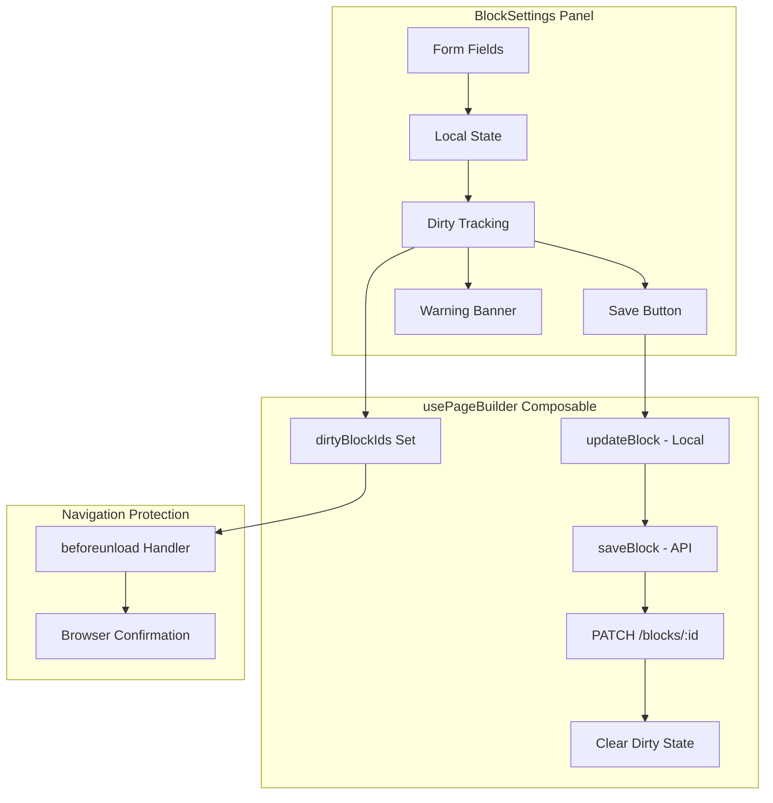

# Feature: Manual Block Save

## Overview

Block content editing in the Page Builder now requires an explicit save action. Users edit block content in the BlockSettings panel and must click "Save Changes" to persist their edits. This gives users full control over when changes are saved and prevents accidental modifications.

## Architecture



## Key Components

| Component | File | Purpose |
|-----------|------|---------|
| BlockSettings | `app/components/publisher/BlockSettings.vue` | UI for editing block content with local dirty state |
| usePageBuilder | `app/composables/usePageBuilder.ts` | State management with `saveBlock()` and `dirtyBlockIds` |
| Page Editor | `app/pages/admin/pages/[id].vue` | Wires `saveBlock` to BlockSettings events |

## User Workflow

1. **Select a block** — Click any block in the canvas to open its settings
2. **Edit content** — Modify form fields (title, text, images, etc.)
3. **See warning** — Amber banner appears: "You have unsaved changes"
4. **Save explicitly** — Click "Save Changes" button to persist
5. **Confirmation** — Success toast appears, warning banner disappears

## UI Elements

### Save Changes Button
- Located at bottom of BlockSettings panel
- Disabled when no unsaved changes exist
- Shows loading state during save operation
- Primary color with checkmark icon

### Unsaved Changes Warning
- Amber/amber warning banner above action buttons
- Shows "You have unsaved changes" with exclamation icon
- Appears immediately when any form field is modified
- Disappears after successful save

### Navigation Protection
- Browser shows confirmation dialog when:
  - Navigating to another page
  - Refreshing the browser
  - Closing the tab
- Message: "You have unsaved block changes. Are you sure you want to leave?"

## Developer Notes

### State Flow

```typescript
// BlockSettings.vue - Local dirty state
const hasChanges = ref(false)

// Track changes without auto-saving
watch(formData, () => {
  hasChanges.value = true
}, { deep: true })

// Emit save event
emit('update-block', blockId, formData)
```

### Composable API

```typescript
const { 
  saveBlock,        // Persist block to API
  dirtyBlockIds,    // Set<number> of unsaved block IDs
  updateBlock,      // Local optimistic update
} = usePageBuilder(pageId)

// Save a specific block
await saveBlock(blockId)
```

### What Auto-Saves vs Manual Save

| Action | Persistence |
|--------|-------------|
| Add block | Immediate (API POST) |
| Delete block | Immediate (API DELETE) |
| Reorder blocks | Immediate (API POST) |
| Edit block content | **Manual** (Save button) |

## Limitations

- Only one block can have unsaved changes at a time (switching blocks clears the form)
- No "Save All" functionality — each block saves independently
- No draft/revision history for unsaved changes


## Related Files

- `app/components/publisher/BlockSettings.vue`
- `app/composables/usePageBuilder.ts`
- `app/pages/admin/pages/[id].vue`
