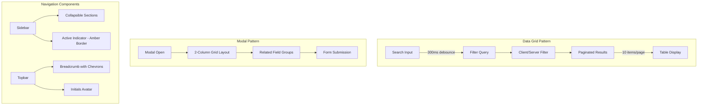

# Feature: Admin UI Polish — Pagination, Search & Navigation

## Overview

This feature delivers a cohesive UX improvement across the Publisher admin interface, standardizing data grid behavior, modal layouts, and navigation components. The changes focus on consistency, usability, and visual polish to create a more professional admin experience.

## Architecture



## Key Components

| Component | File | Purpose |
|-----------|------|---------|
| Pages List | `pages/admin/pages/index.vue` | Server-side pagination + search for pages |
| Content Types List | `pages/admin/types/index.vue` | Client-side pagination + search for content types |
| Block Types List | `pages/admin/types/blocks/index.vue` | Client-side pagination + search with modal forms |
| Users List | `pages/admin/settings/users.vue` | Client-side pagination + search for user management |
| Sidebar | `components/publisher/Sidebar.vue` | Refined navigation with collapsible sections |
| Topbar | `components/publisher/Topbar.vue` | Polished header with breadcrumbs and user menu |

## Implementation Details

### 1. Standardized Pagination

All data grids now use **10 items per page** as the standard page size:

```typescript
const pageSize = 10
const page = ref(1)
```

Pagination is displayed at the bottom of tables when total items exceed one page:

```vue
<div v-if="totalPages > 1" class="flex items-center justify-between px-4 py-3 border-t">
  <p class="text-sm text-stone-500">
    Showing {{ ((page - 1) * pageSize) + 1 }}–{{ Math.min(page * pageSize, total) }} of {{ total }}
  </p>
  <UPagination v-model:page="page" :total="total" :items-per-page="pageSize" />
</div>
```

### 2. Debounced Search

All search inputs implement a **300ms debounce** to prevent excessive API calls and UI thrashing:

```typescript
const search = ref('')
const debouncedSearch = ref('')

let searchTimeout: ReturnType<typeof setTimeout> | null = null
watch(search, (newValue) => {
  if (searchTimeout) clearTimeout(searchTimeout)
  searchTimeout = setTimeout(() => {
    debouncedSearch.value = newValue
    page.value = 1 // Reset to first page on search
  }, 300)
})
```

### 3. Modal Input Layouts

Modals use a **2-column grid pattern** for related fields, avoiding full-width inputs:

```vue
<div class="grid grid-cols-2 gap-4">
  <UFormField label="Display Name" required>
    <UInput v-model="form.displayName" />
  </UFormField>
  <UFormField label="API Name" required>
    <UInput v-model="form.name" />
  </UFormField>
</div>
```

Common field groupings:
- Display Name + API Name
- Category + Icon
- First Name + Last Name
- Email + Role

### 4. Sidebar Refinements

**Visual enhancements:**
- Subtle shadow: `shadow-[1px_0_3px_rgba(0,0,0,0.02)]`
- Section labels: Uppercase, 11px, tracking-wider
- Active indicator: 3px amber-500 left border

**Collapsible sections:**
```typescript
const expandedSections = ref<Set<string>>(new Set(['Content', 'Types']))

const toggleSection = (label: string) => {
  if (expandedSections.value.has(label)) {
    expandedSections.value.delete(label)
  } else {
    expandedSections.value.add(label)
  }
}
```

**Active state styling:**
```vue
:class="item.active
  ? 'bg-amber-50 text-amber-700 font-medium border-l-[3px] border-amber-500 -ml-[3px] pl-[calc(0.75rem+3px)]'
  : 'text-stone-700 hover:bg-stone-50'"
```

### 5. Topbar Refinements

**Breadcrumb with chevron separator:**
```vue
<div class="flex items-center gap-2 text-sm">
  <NuxtLink to="/admin">
    <UIcon name="i-heroicons-home" class="w-4 h-4" />
  </NuxtLink>
  <UIcon name="i-heroicons-chevron-right" class="w-4 h-4 text-stone-300" />
  <span class="text-amber-700 font-medium">{{ title }}</span>
</div>
```

**Initials avatar:**
```vue
<div class="w-8 h-8 rounded-full bg-amber-100 flex items-center justify-center">
  <span class="text-sm font-medium text-amber-700">
    {{ user?.firstName?.charAt(0)?.toUpperCase() || 'U' }}
  </span>
</div>
```

## Design Decisions

| Decision | Rationale |
|----------|-----------|
| 10 items/page | Balances information density with scrolling; matches common admin UI patterns |
| 300ms debounce | Prevents excessive filtering while remaining responsive to user input |
| 2-column modal layout | Groups related fields visually; prevents sparse full-width forms |
| Amber accent color | Provides warm, distinctive active states without being jarring |
| Collapsible sidebar sections | Reduces visual clutter while keeping navigation accessible |

## Affected Pages

- `/admin/pages` — Pages list with server-side pagination
- `/admin/types` — Content types list with client-side filtering
- `/admin/types/blocks` — Block types list with modal editors
- `/admin/settings/users` — User management with role-based display

## Limitations

- Pages list uses server-side pagination via API; other lists use client-side filtering
- Search is case-insensitive but does not support fuzzy matching
- Collapsible section state is not persisted across page reloads


## Related Files

- `lib/publisher-admin/pages/admin/pages/index.vue`
- `lib/publisher-admin/pages/admin/types/index.vue`
- `lib/publisher-admin/pages/admin/types/blocks/index.vue`
- `lib/publisher-admin/pages/admin/settings/users.vue`
- `lib/publisher-admin/components/publisher/Sidebar.vue`
- `lib/publisher-admin/components/publisher/Topbar.vue`
