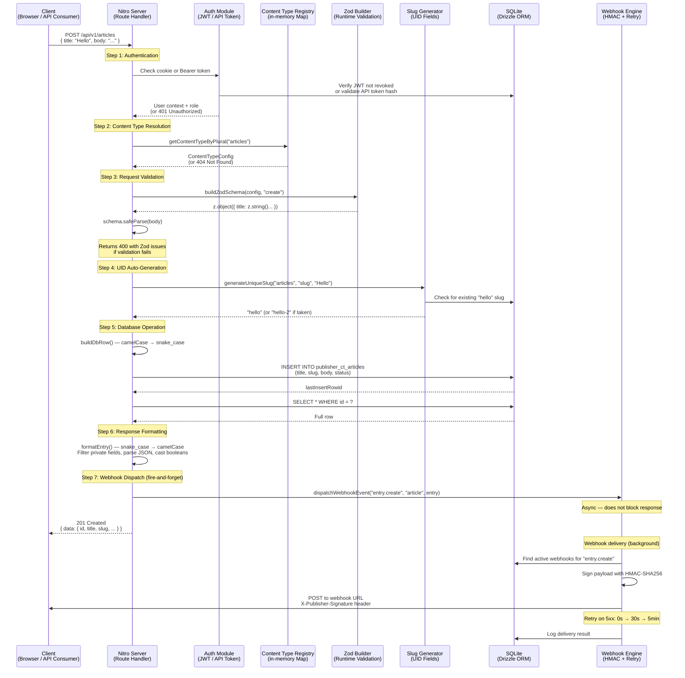

# Flow: Content API Request Flow

## Overview

Every content API request (`/api/v1/{type}/*`) follows a consistent pipeline: route matching → authentication check → content type resolution → request validation → database operation → webhook dispatch → response formatting. This flow applies to all CRUD operations on any registered content type.

This document traces the full lifecycle of a **POST (create)** request as the most complete example, noting where GET/PUT/PATCH/DELETE diverge.

## Flow Diagram

## Steps

### 1. Authentication Check

The route handler calls `requireAuth(event)` which checks `event.context.publisherUser`. This context is populated by server middleware that:

- **Cookie auth (admin UI):** Reads the `publisher-session` httpOnly cookie, verifies the JWT signature and expiry via `jose`, then checks the `jti` against the `publisher_revoked_tokens` table to ensure the token hasn't been revoked.
- **API token auth (programmatic):** Reads the `Authorization: Bearer <token>` header, hashes the token with PBKDF2-SHA256, and looks up the hash in `publisher_api_tokens`. Updates `last_used_at` on match.

**GET requests** skip authentication — unauthenticated users see only published entries (when `draftAndPublish` is enabled). Write operations (POST/PUT/PATCH/DELETE) always require authentication.

### 2. Content Type Resolution

`resolveContentType(event)` extracts the `[type]` route parameter (e.g., `"articles"`) and calls `getContentTypeByPlural()` on the in-memory registry. The registry is a `Map<string, ContentTypeConfig>` populated at server startup by scanning `content-types/*.ts`.

If the plural name doesn't match any registered type, a **404** is returned with error code `TYPE_NOT_FOUND`.

### 3. Request Body Validation (Write Operations)

For POST/PUT/PATCH, the `zodBuilder` dynamically generates a Zod schema from the content type's field definitions:

| Field Type | Zod Schema |
|------------|------------|
| `string` | `z.string().max(n)` |
| `email` | `z.string().email()` |
| `number` | `z.number().min(n).max(n)` |
| `boolean` | `z.boolean()` |
| `enum` | `z.enum([...options])` |
| `uid` | `z.string().regex(/^[a-z0-9]+(?:-[a-z0-9]+)*$/).optional()` |
| `relation` | `z.number().int().positive()` or `z.array(...)` for *ToMany |
| `json` | `z.any()` |

In **create** mode, required fields are enforced. In **update** mode, all fields become optional (partial update).

If validation fails, a **400** is returned with the full Zod issue array in `error.details`.

### 4. UID Auto-Generation

For fields with `type: 'uid'`, the system checks if a value was provided. If not, it:

1. Reads the `targetField` value (e.g., `title` → `"Hello World"`)
2. Slugifies it: `"hello-world"`
3. Queries the database for uniqueness
4. Appends `-2`, `-3`, etc. if a collision is found

### 5. Database Operation

The validated and processed data is converted from camelCase API format to snake_case database columns via `buildDbRow()`. Type coercions are applied:

- **Booleans** → `0` / `1` (SQLite integers)
- **JSON objects** → `JSON.stringify()` (stored as TEXT)
- **Draft status** → defaults to `'draft'` if `draftAndPublish` is enabled

The SQL is executed directly via `better-sqlite3` prepared statements against the `publisher_ct_{pluralName}` table.

### 6. Response Formatting

`formatEntry()` converts the raw database row back to API format:

- snake_case columns → camelCase keys
- `private: true` fields are stripped from the response
- JSON TEXT columns are parsed back to objects
- Integer booleans are cast to `true` / `false`

### 7. Webhook Dispatch

`dispatchWebhookEvent()` fires asynchronously (fire-and-forget) after the response is sent:

1. Queries `publisher_webhooks` for active webhooks subscribed to the event
2. Builds a JSON payload: `{ event, contentType, entry, timestamp }`
3. Signs the payload body with HMAC-SHA256 using the webhook's secret
4. POSTs to the webhook URL with headers: `Content-Type`, `User-Agent`, `X-Publisher-Event`, `X-Publisher-Signature`
5. Each request has a 10-second timeout

## Error Handling

| Step | Error | HTTP Status | Error Code |
|------|-------|-------------|------------|
| Auth | Missing or invalid token | 401 | `UNAUTHORIZED` |
| Auth | Revoked JWT | 401 | `UNAUTHORIZED` |
| Resolution | Unknown content type | 404 | `TYPE_NOT_FOUND` |
| Validation | Invalid request body | 400 | `VALIDATION_ERROR` |
| Database | Unique constraint violation | 409 | `CONFLICT` |
| Database | General DB error | 500 | `INTERNAL_ERROR` |

## Edge Cases

- **Unauthenticated GET requests** with `draftAndPublish` enabled automatically filter to `status = 'published'` only. Admin sessions can see all statuses and filter with `filters[status]=draft`.
- **Soft-deleted entries** are excluded from all queries by default (`deleted_at IS NULL`). DELETE operations set `deleted_at` rather than removing the row.
- **UID collision resolution** is deterministic — it always appends the lowest available integer suffix (`-2`, `-3`, etc.).
- **Webhook failures** on 4xx responses are not retried (client error). Only 5xx and network errors trigger the retry sequence.
- **Webhook dispatch** never blocks the API response — errors are logged but do not affect the client.

## Related Files

- `server/api/v1/[type]/index.post.ts`
- `server/api/v1/[type]/index.get.ts`
- `server/utils/publisher/contentApi.ts`
- `server/utils/publisher/zodBuilder.ts`
- `server/utils/publisher/registry.ts`
- `server/utils/publisher/schemaCompiler.ts`
- `server/utils/publisher/webhooks.ts`
- `server/utils/publisher/slug.ts`
- `server/utils/publisher/db.ts`
