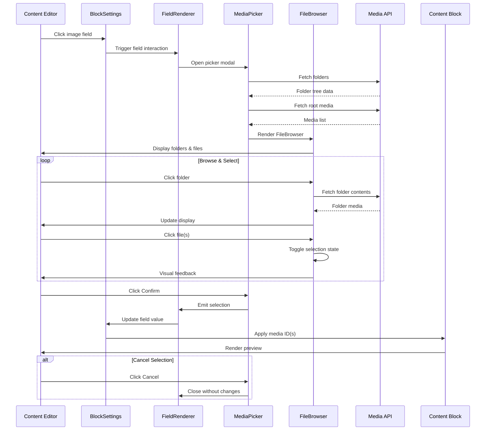

# Flow: Media Selection Workflow

## Overview

This flow documents the user interaction pattern for selecting media through the MediaPicker. It covers the complete journey from initiating a selection to confirming and applying media to content blocks.

## Flow Diagram

## Steps

1. **Initiate Selection** — Editor clicks on an image field in the BlockSettings panel, triggering the FieldRenderer to open the MediaPicker modal.

2. **Load Initial Data** — MediaPicker fetches the folder tree structure and root-level media files from the API in parallel.

3. **Browse Content** — Editor navigates through the folder hierarchy using the FolderTree sidebar or by clicking FolderCard components in the main grid.

4. **Select Media** — Editor clicks on FileCard components to select/deselect files. In single-select mode, clicking a new file replaces the current selection. In multi-select mode (galleries), multiple files can be selected.

5. **Confirm Selection** — Editor clicks the Confirm button in the SelectionBar. The selected media IDs are emitted back to the FieldRenderer.

6. **Apply to Block** — The FieldRenderer updates the field value, which propagates to the content block and renders a preview of the selected media.

## Error Handling

| Scenario | Behavior |
|----------|----------|
| API fetch fails | Display error message, retry button available |
| No media in folder | Show empty state with upload prompt |
| Invalid file type | Gray out non-image files, show tooltip on hover |
| Network timeout | Retry automatically up to 3 times, then show error |
| Selection limit exceeded | Show warning toast, prevent additional selections |

## Edge Cases

- **Empty Media Library**: When no media exists, the FileBrowser shows an empty state with a prompt to upload files via the main File Manager.

- **Deep Folder Nesting**: The FolderTree collapses deeply nested folders by default, expanding on click. Breadcrumb navigation is available.

- **Large File Counts**: Pagination is applied automatically (50 items per page) with infinite scroll in the FileGrid.

- **Concurrent Edits**: If another user modifies the media library, the picker does not auto-refresh. Editor must manually refresh or re-open the picker.

- **Pre-existing Selection**: When opening the picker with an existing value, the corresponding file is pre-selected and scrolled into view.

## Related Files

- `components/media/MediaPicker.vue`
- `components/media/FileBrowser.vue`
- `components/media/SelectionBar.vue`
