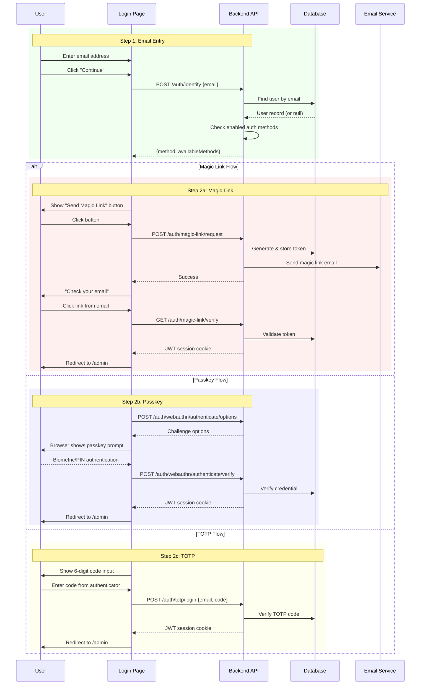

# Flow: Passwordless Authentication

## Overview

The two-step passwordless authentication flow guides users through login without passwords. The system automatically detects the user's configured authentication method and presents the appropriate interface.

## Flow Diagram

## Steps

### Step 1: Email Entry

1. **Display email input** — Single field with "Continue" button
2. **Validate email format** — Client-side regex validation
3. **Call identify endpoint** — `POST /api/publisher/auth/identify`
4. **Handle response** — Transition to Step 2 with detected method

### Step 2: Method-Specific Authentication

#### Magic Link Method
1. **Show explanation** — "We'll send you a secure sign-in link"
2. **User clicks "Send Magic Link"**
3. **API sends email** — Token valid for 15 minutes
4. **Display success message** — "Check your email for a sign-in link"
5. **User clicks link** — Opens `/auth/magic-link/verify?token=...`
6. **Session created** — JWT cookie set, redirect to admin

#### Passkey Method
1. **Auto-trigger prompt** — 100ms delay after UI renders
2. **Browser shows native UI** — Fingerprint, Face ID, or security key
3. **User authenticates** — Biometric or PIN
4. **Backend verifies** — WebAuthn challenge/response
5. **Session created** — JWT cookie set, redirect to admin

#### TOTP Method
1. **Show code input** — 6-digit numeric field
2. **User enters code** — From authenticator app (Google Auth, Authy, etc.)
3. **Submit for verification** — `POST /api/publisher/auth/totp/login`
4. **Session created** — JWT cookie set, redirect to admin

### Alternative Methods

If user has multiple auth methods configured, alternative options appear:
- "Other sign-in methods:" section shows available alternatives
- User can switch between methods without re-entering email

## Error Handling

| Scenario | Handling |
|----------|----------|
| Invalid email format | Client-side validation, show error message |
| Unknown email | Return generic magic-link response (no error) |
| Rate limit exceeded | 429 error, show "Too many attempts" |
| Magic link expired | Clear error message, offer to resend |
| Passkey not supported | Show browser compatibility warning |
| Invalid TOTP code | "Invalid code" error, allow retry |
| Account inactive | Generic response (same as unknown email) |

## Security Measures

- **Email enumeration prevention**: Unknown emails return same response as known users
- **Timing attack mitigation**: Minimum 100ms response time for identify endpoint
- **Rate limiting**: 5 identify requests per email per hour
- **Token expiration**: Magic links expire in 15 minutes
- **Single-use tokens**: Magic link tokens are consumed on use

## Edge Cases

- **Browser back button**: Maintains state, returns to email entry
- **Multiple devices**: Passkeys sync across devices (iCloud, Google)
- **Backup codes**: TOTP users can use backup codes if authenticator is lost
- **Method switching**: Users with multiple methods can switch at any time
- **Session persistence**: JWT valid for 7 days, refreshable

## Related Files

- `app/pages/admin/login.vue`
- `server/api/publisher/auth/identify.post.ts`
- `server/api/publisher/auth/magic-link/request.post.ts`
- `server/api/publisher/auth/webauthn/authenticate/options.post.ts`
- `server/api/publisher/auth/totp/login.post.ts`
