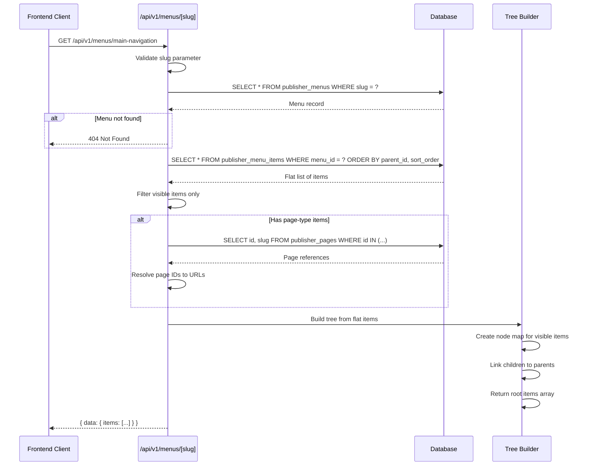

# Flow: Menu API Request Flow

## Overview

This document describes the request flow when fetching a hierarchical menu tree from the public API. The flow covers how flat database rows are transformed into a nested tree structure suitable for frontend rendering.

## Flow Diagram



## Steps

1. **Request Validation** — The API validates that the slug parameter is a non-empty string. Invalid slugs return a 400 error.

2. **Menu Lookup** — Query `publisher_menus` table by slug. If no menu exists with that slug, return 404.

3. **Fetch All Items** — Query all menu items for the menu, ordered by `parent_id NULLS FIRST`, then `sort_order`. This ordering ensures parents are processed before children.

4. **Filter Visible Items** — Items with `visible = false` are excluded from the public response. This allows hiding items without deleting them.

5. **Resolve Page URLs** — For items with `type = 'page'`, collect all `pageId` values from metadata and batch query the pages table. Replace page IDs with actual URLs (e.g., `/about-us`).

6. **Build Tree Structure** — The `buildMenuTree()` function transforms the flat list into a nested structure:
   - First pass: Create `MenuItemNode` objects for all visible items, store in Map by ID
   - Second pass: Link each item to its parent's `children` array, or add to root array if no parent

7. **Return Response** — The API returns the menu metadata with the nested `items` array.

## Tree Building Algorithm

```typescript
function buildMenuTree(items: FlatMenuItem[]): MenuItemNode[] {
  // Map to store all nodes by ID
  const itemMap = new Map<number, MenuItemNode>()
  const rootItems: MenuItemNode[] = []

  // First pass: Create all nodes
  for (const item of items) {
    if (!item.visible) continue
    itemMap.set(item.id, { ...item, children: [] })
  }

  // Second pass: Build hierarchy
  for (const item of items) {
    if (!item.visible) continue
    const node = itemMap.get(item.id)
    
    if (item.parentId === null) {
      rootItems.push(node)
    } else {
      const parent = itemMap.get(item.parentId)
      if (parent) {
        parent.children.push(node)
      }
    }
  }

  return rootItems
}
```

## Error Handling

| Scenario | Status | Error Code |
|----------|--------|------------|
| Missing/empty slug | 400 | `INVALID_PARAM` |
| Menu not found | 404 | `NOT_FOUND` |
| Database error | 500 | `INTERNAL_ERROR` |

## Edge Cases

### Hidden Parent with Visible Children
If a parent item is hidden (`visible = false`) but has visible children, the children are orphaned and will not appear in the tree. The tree builder only processes items where `visible = true`, and children can only be linked to visible parents.

**Recommendation:** When hiding a parent, consider hiding all descendants or moving them to a new parent.

### Circular References
The current implementation does not prevent circular parent chains (e.g., A → B → C → A). This would cause infinite loops. The database schema allows this, so it must be prevented at the application level.

### Deep Nesting
There is no limit on nesting depth. Very deep trees (10+ levels) may impact frontend rendering performance. Consider limiting depth in the admin UI.

### Missing Page References
If a page-type item references a deleted page, the URL will be undefined. The page ID resolution silently fails for missing pages.

## Performance Considerations

- **Single query for items** — All items fetched in one query, not N+1
- **Batch page resolution** — Pages fetched in single query using `IN` clause
- **In-memory tree building** — O(n) complexity for typical menu sizes
- **Database indexes** — Indexes on `menu_id`, `parent_id`, and `sort_order` ensure fast queries

## Related

- [Menu System Feature](../features/2026-03-08-menu-system.md)
- [Menu Hierarchy Pattern](../decisions/2026-03-08-menu-hierarchy-pattern.md)

## Related Files

- `server/api/v1/menus/[slug].get.ts`
- `server/api/v1/menus/index.get.ts`
